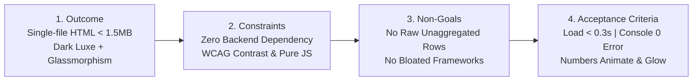
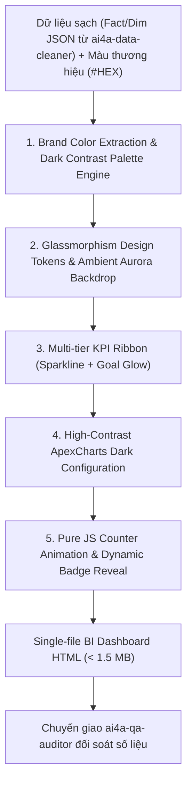

# AI4A: Executive Modern BI Dashboard Architect (`/ai4a:build-dashboard-BI`)

> **Bộ phận Kiến Trúc & Xây Dựng Executive BI Dashboard Hiện Đại**  
> *Đóng gói & phát triển theo chuẩn nghiệp vụ AI4A - Agentic AI with Google Antigravity*

Skill này chuyên trách chuyển hóa các tập dữ liệu kinh doanh đã làm sạch thành **Dashboard BI Điều Hành Cấp Cao (C-Level Executive Dashboard)** với bộ tiêu chuẩn thị giác hiện đại bậc nhất: **Dark Mode thời thượng, hiệu ứng kính mờ (Glassmorphism), thẻ KPI đa tầng (Multi-tier KPI Cards) nhúng Mini Sparkline, hiệu ứng số nhảy mượt mà kèm Dynamic Badge Reveal, và dải màu tương phản cao tự động thích ứng theo thương hiệu.**

Toàn bộ sản phẩm đầu ra được đóng gói dưới dạng **Single-file HTML độc lập (< 1.5 MB)**, mở xem tức thì qua giao thức `file:///` mà không cần cài đặt Web Server nội bộ.

---

## 1. Bản Hợp Đồng Thực Thi (Core Contract)

Mỗi lần kích hoạt skill `/ai4a:build-dashboard-BI` đều phải cam kết nghiêm ngặt 4 trường hợp đồng:



1. **Outcome (Kết quả đầu ra):**
   - **01 File HTML độc lập duy nhất (Standalone Single-file):** Dung lượng **< 1.5 MB**, tự chứa toàn bộ CSS Glassmorphism tokens, Javascript animation, cấu hình ApexCharts Dark Mode và dữ liệu JSON đã được tiền tổng hợp (Pre-aggregated).
   - **Bố cục điều hành chuẩn C-Level:**
     - *Header & Dynamic Slicer Bar:* Bộ lọc thời gian (Today, WTD, MTD, QTD, YTD) và bộ lọc đơn vị/vùng miền, nút chuyển đổi toàn màn hình (Fullscreen) và xuất báo cáo.
     - *Hero KPI Ribbon (4 - 6 Thẻ KPI Đa Tầng):* Số lớn nhảy số (Counter Animation), Badge tăng trưởng (+/- % vs kỳ trước), Mini Sparkline 7-30 ngày liền khối và thanh tiến độ Goal Progress phát sáng (Neon Glow).
     - *Main Interactive Charts Grid:* Lưới 3 - 4 biểu đồ ApexCharts tương phản cao (Doanh thu theo thời gian, Cơ cấu danh mục, Top hiệu suất thực thể).
     - *Actionable Insights & Exception Table:* Bảng chi tiết có thanh tìm kiếm tức thì (< 0.1s), highlight trực quan các ngoại lệ cần hành động.
2. **Constraints (Ràng buộc kỹ thuật):**
   - **Zero Backend Dependency:** Chạy mượt mà trực tiếp từ ổ cứng (`file:///`) trên mọi trình duyệt hiện đại (Chrome, Edge, Safari, Firefox).
   - **Thuần CSS & JS Siêu Nhẹ:** Hiệu ứng số nhảy viết bằng Pure Vanilla JS (`requestAnimationFrame`), không dùng thư viện ngoài cồng kềnh để đảm bảo tốc độ và bảo mật.
   - **Chuẩn Tương Phản WCAG AA/AAA:** Các đường nét biểu đồ, văn bản chỉ số và badge cảnh báo phải đạt độ tương phản tối thiểu 4.5:1 trên nền Dark Mode.
   - **Bảo mật dữ liệu tuyệt đối:** Dữ liệu nằm trọn vẹn trong file, không gửi bất kỳ request mạng nào ra ngoài máy chủ bên thứ ba (ngoại trừ nạp CDN ApexCharts/Google Fonts khi có Internet, có cơ chế fallback).
3. **Non-goals (Phạm vi không làm):**
   - Không nhúng dữ liệu thô hàng chục ngàn dòng giao dịch chi tiết (Raw Ledger); dữ liệu bắt buộc phải qua bước tiền tổng hợp (Pre-aggregation) của `ai4a-data-cleaner`.
   - Không sử dụng giao diện Light Mode thông thường; tôn trọng triệt để trải nghiệm Dark Mode cao cấp (Executive Dark Luxe).
4. **Acceptance Criteria (Tiêu chí nghiệm thu):**
   - Tốc độ tải trang: **< 0.3 giây** trên cả máy tính và điện thoại.
   - **Console Errors = 0:** Tuyệt đối không có bất kỳ lỗi cú pháp JavaScript hoặc cảnh báo CSS nghiêm trọng trong F12 Console.
   - **Trải nghiệm thị giác vượt trội:** Hiệu ứng số nhảy chạy êm trong 1.5s, kết thúc bằng hiệu ứng đổi màu badge phát sáng rực rỡ (Dynamic Reveal).
   - **Đối soát số học 100%:** Số liệu tổng và tỷ lệ % khớp từng đơn vị với kết quả từ `ai4a-data-cleaner`.

---

## 2. Quy Trình Kiến Trúc Dashboard Chuẩn OIPO



---

## 3. Hệ Thống Design Tokens: Glassmorphism & Dark Mode

Giao diện áp dụng bộ biến số CSS Variables chuẩn mực, tạo hiệu ứng chiều sâu không gian (Spatial Depth) bằng kỹ thuật nhiều lớp kính mờ (Frosted Glass) và ánh sáng nền cực quang (Ambient Aurora Glow).

```css
:root {
  /* --- 1. Background Bases & Ambient Aura --- */
  --bg-deep: #070a13;
  --bg-surface: #0b0f19;
  --bg-ambient-1: rgba(0, 242, 254, 0.08); /* Cyan Ambient */
  --bg-ambient-2: rgba(139, 92, 246, 0.08); /* Violet Ambient */

  /* --- 2. Glassmorphism Tokens --- */
  --glass-card: rgba(18, 26, 47, 0.65);
  --glass-card-hover: rgba(24, 35, 63, 0.8);
  --glass-border: rgba(255, 255, 255, 0.08);
  --glass-border-hover: rgba(255, 255, 255, 0.22);
  --glass-blur: blur(16px);
  --glass-shadow: 0 8px 32px 0 rgba(0, 0, 0, 0.45);
  --glass-glow: 0 0 25px rgba(0, 242, 254, 0.15);

  /* --- 3. Typography & Text Contrast --- */
  --text-primary: #f8fafc;   /* White / Slate 50 */
  --text-secondary: #94a3b8; /* Slate 400 */
  --text-muted: #64748b;     /* Slate 500 */
  --font-heading: 'Outfit', sans-serif;
  --font-data: 'Plus Jakarta Sans', -apple-system, sans-serif;

  /* --- 4. High-Contrast Status Palettes --- */
  --neon-emerald: #10b981;
  --neon-emerald-glow: 0 0 14px rgba(16, 185, 129, 0.5);
  --neon-rose: #f43f5e;
  --neon-rose-glow: 0 0 14px rgba(244, 63, 94, 0.5);
  --neon-amber: #f59e0b;
  --neon-amber-glow: 0 0 14px rgba(245, 158, 11, 0.5);
  --neon-cyan: #00f2fe;
  --neon-cyan-glow: 0 0 14px rgba(0, 242, 254, 0.5);
}

/* Hiệu ứng Kính Mờ Chuẩn Quốc Tế */
.glass-panel {
  background: var(--glass-card);
  backdrop-filter: var(--glass-blur);
  -webkit-backdrop-filter: var(--glass-blur);
  border: 1px solid var(--glass-border);
  border-radius: 16px;
  box-shadow: var(--glass-shadow);
  transition: all 0.3s cubic-bezier(0.16, 1, 0.3, 1);
}

.glass-panel:hover {
  background: var(--glass-card-hover);
  border-color: var(--glass-border-hover);
  transform: translateY(-3px);
  box-shadow: var(--glass-shadow), var(--glass-glow);
}
```

---

## 4. Công Thức Trích Xuất Màu Thương Hiệu Sang Dải Tương Phản Cao

Khi người dùng cung cấp mã màu thương hiệu (Brand Color Hex hoặc Logo), skill áp dụng quy tắc chuyển hóa quang học để tạo dải tương phản cao trên nền tối:

| Thành Tố Giao Diện | Quy Tắc Chuyển Đổi Quang Học (Color Transformation) | Ví Dụ: Heineken (`#008200`) | Ví Dụ: Tiger (`#0055B8`) |
| :--- | :--- | :--- | :--- |
| **Ambient Aura Tint** | Pha màu chính với độ mờ 8% (`rgba(brand, 0.08)`) trên nền `#070A13` | `rgba(0, 130, 0, 0.08)` | `rgba(0, 85, 184, 0.08)` |
| **Neon Accent Highlight** | Tăng độ bão hòa (Saturation 100%) và tăng sáng (Lightness ~55%) | `#00FF66` (Neon Emerald) | `#00D2FF` (Electric Cyan) |
| **Glass Border Tone** | Pha 15% màu thương hiệu vào viền kính trắng | `rgba(0, 255, 102, 0.18)` | `rgba(0, 210, 255, 0.18)` |
| **ApexCharts Primary Gradient** | Gradient từ Neon Accent xuống màu trầm thương hiệu | `['#00FF66', '#008200']` | `['#00D2FF', '#0055B8']` |
| **Secondary Contrast Series** | Chọn góc bù màu (Complementary 120° hoặc 180°) để biểu đồ rõ ràng | Vàng ánh kim `#FFB800` & Đỏ `#F43F5E` | Cam lửa `#FF6B00` & Vàng `#F59E0B` |

---

## 5. Đặc Tả Kỹ Thuật Thẻ KPI Đa Tầng (Multi-Tier KPI Cards)

Mỗi thẻ KPI được cấu trúc thành 4 tầng thông tin nhất quán:

```text
┌──────────────────────────────────────────────────────────┐
│ [Icon] TỔNG DOANH SỐ THỰC ĐẠT (MTD)            [Sparkline]│
│                                              📈 7D Trend │
│ 142.85 Tỷ VNĐ                                            │
│ (Số chạy từ 0 -> 142.85 trong 1.5s)                      │
│                                                          │
│ [ ▲ +14.2% vs Tháng trước ]  (Reveal phát sáng khi đếm xong)│
│                                                          │
│ Tiến độ chỉ tiêu: 104.5%                                 │
│ [████████████████████████████████████████] (Neon Glow Bar)│
└──────────────────────────────────────────────────────────┘
```

### Cấu Trúc HTML & CSS Mẫu Cho Thẻ KPI:

```html
<div class="glass-panel kpi-card">
  <!-- Tầng 1: Header + Micro Sparkline -->
  <div class="kpi-header">
    <div class="kpi-meta">
      <span class="kpi-icon-box">💰</span>
      <span class="kpi-label">Doanh Thu Thuần (MTD)</span>
    </div>
    <div class="kpi-sparkline" id="sparkline-revenue"></div>
  </div>

  <!-- Tầng 2: Giá trị số lớn với hiệu ứng số nhảy -->
  <div class="kpi-value-wrapper">
    <span class="kpi-value counter" 
          data-target="142.85" 
          data-prefix="" 
          data-suffix=" Tỷ" 
          data-decimals="2">0.00</span>
  </div>

  <!-- Tầng 3: Badge tăng trưởng với hiệu ứng Dynamic Reveal -->
  <div class="kpi-footer">
    <div class="kpi-badge badge-pending" data-growth="+14.2%" data-status="positive">
      <span class="badge-icon">▲</span>
      <span class="badge-text">+14.2% vs Tháng trước</span>
    </div>
  </div>

  <!-- Tầng 4: Thanh tiến độ mục tiêu phát sáng -->
  <div class="kpi-progress-wrapper">
    <div class="progress-info">
      <span>Mục tiêu: 136.7 Tỷ</span>
      <span class="progress-percent">104.5%</span>
    </div>
    <div class="progress-track">
      <div class="progress-fill glow-emerald" style="width: 100%;"></div>
    </div>
  </div>
</div>
```

---

## 6. Động Cơ Số Nhảy Pure JS & Hiệu Ứng Dynamic Badge Reveal

Không cần nạp bất kỳ thư viện ngoài nào, đoạn script dưới đây đảm bảo số nhảy cực êm theo hàm `easeOutExpo` trong đúng 1500ms, tự động định dạng số và kích hoạt huy hiệu đổi màu phát sáng ngay khi số chạm đích:

```javascript
/**
 * AI4A Pure JS Counter Animation Engine with Dynamic Badge Reveal
 * Tối ưu 60fps - Zero Bloat - Hỗ trợ chuẩn tiền tệ Việt Nam & Quốc tế
 */
function initModernCounters() {
  const duration = 1500; // 1.5s
  const easeOutExpo = (t) => (t === 1 ? 1 : 1 - Math.pow(2, -10 * t));
  const counters = document.querySelectorAll('.counter');

  counters.forEach((counter) => {
    const target = parseFloat(counter.getAttribute('data-target')) || 0;
    const prefix = counter.getAttribute('data-prefix') || '';
    const suffix = counter.getAttribute('data-suffix') || '';
    const decimals = parseInt(counter.getAttribute('data-decimals') || '0', 10);
    const parentCard = counter.closest('.kpi-card');
    const badge = parentCard ? parentCard.querySelector('.kpi-badge') : null;

    let startTime = null;

    function step(timestamp) {
      if (!startTime) startTime = timestamp;
      const progress = Math.min((timestamp - startTime) / duration, 1);
      const easedProgress = easeOutExpo(progress);
      const currentValue = easedProgress * target;

      // Format số với dấu phẩy phân tách hàng nghìn
      const formatted = currentValue.toLocaleString('vi-VN', {
        minimumFractionDigits: decimals,
        maximumFractionDigits: decimals
      });

      counter.textContent = `${prefix}${formatted}${suffix}`;

      if (progress < 1) {
        requestAnimationFrame(step);
      } else {
        // Đếm xong: kích hoạt Dynamic Badge Reveal
        if (badge) {
          badge.classList.remove('badge-pending');
          const status = badge.getAttribute('data-status');
          if (status === 'positive') {
            badge.classList.add('badge-revealed-emerald');
          } else if (status === 'negative') {
            badge.classList.add('badge-revealed-rose');
          } else {
            badge.classList.add('badge-revealed-neutral');
          }
        }
      }
    }

    requestAnimationFrame(step);
  });
}

// Tự động kích hoạt khi DOM tải xong
document.addEventListener('DOMContentLoaded', initModernCounters);

// Hàm tái kích hoạt khi người dùng thay đổi bộ lọc Slicer
function retriggerCounters() {
  document.querySelectorAll('.kpi-badge').forEach(b => {
    b.className = 'kpi-badge badge-pending';
  });
  initModernCounters();
}
```

### CSS Cho Hiệu Ứng Dynamic Badge Reveal:

```css
/* Trạng thái trong lúc số đang nhảy: Xám mờ trung tính */
.badge-pending {
  background: rgba(255, 255, 255, 0.05);
  color: var(--text-muted);
  border: 1px solid rgba(255, 255, 255, 0.05);
  opacity: 0.5;
  transition: all 0.5s ease;
}

/* Trạng thái hoàn tất: Phát sáng Xanh Neon rực rỡ */
.badge-revealed-emerald {
  background: rgba(16, 185, 129, 0.15);
  color: #34d399;
  border: 1px solid rgba(16, 185, 129, 0.35);
  box-shadow: var(--neon-emerald-glow);
  opacity: 1;
  transform: scale(1.05);
  animation: pulseOnce 0.6s ease-out;
}

/* Trạng thái hoàn tất: Phát sáng Đỏ Neon cảnh báo */
.badge-revealed-rose {
  background: rgba(244, 63, 94, 0.15);
  color: #fb7185;
  border: 1px solid rgba(244, 63, 94, 0.35);
  box-shadow: var(--neon-rose-glow);
  opacity: 1;
  transform: scale(1.05);
  animation: pulseOnce 0.6s ease-out;
}

@keyframes pulseOnce {
  0% { transform: scale(0.95); }
  50% { transform: scale(1.1); }
  100% { transform: scale(1); }
}
```

---

## 7. Cấu Hình ApexCharts Dark Mode Tương Phản Cao

Để biểu đồ hòa quyện hoàn hảo vào không gian Glassmorphism mà vẫn nổi bật rực rỡ:

```javascript
// ApexCharts Global Dark Theme Preset
const apexDarkBase = {
  chart: {
    background: 'transparent',
    foreColor: '#94A3B8',
    fontFamily: "'Plus Jakarta Sans', sans-serif",
    toolbar: { show: false }
  },
  theme: { mode: 'dark' },
  grid: {
    borderColor: 'rgba(255, 255, 255, 0.05)',
    strokeDashArray: 3
  },
  tooltip: {
    theme: 'dark',
    style: { fontSize: '12px' },
    custom: function({ series, seriesIndex, dataPointIndex, w }) {
      // Custom Glassmorphism Tooltip
      const val = series[seriesIndex][dataPointIndex];
      const name = w.globals.categoryNames[dataPointIndex] || w.globals.seriesNames[seriesIndex];
      return `
        <div style="background: rgba(15, 23, 42, 0.85); backdrop-filter: blur(12px); border: 1px solid rgba(255,255,255,0.15); padding: 8px 12px; border-radius: 8px; box-shadow: 0 8px 24px rgba(0,0,0,0.5);">
          <div style="font-size: 11px; color: #94A3B8; text-transform: uppercase;">${name}</div>
          <div style="font-size: 14px; font-weight: 700; color: #00F2FE; margin-top: 2px;">${val.toLocaleString('vi-VN')}</div>
        </div>
      `;
    }
  }
};
```

---

## 8. Quy Trình Phối Hợp Tác Chiến Multi-Agent (Handoff Protocol)

1. **Bước Nhận Dữ Liệu (Upstream):**  
   Tiếp nhận file JSON tiền tổng hợp từ skill `ai4a-data-cleaner`. Kiểm tra schema gồm ít nhất: `summary_metrics`, `daily_trend`, `entity_performance`, `category_breakdown`.
2. **Bước Khởi Tạo Dashboard (Execution):**  
   Tạo file HTML độc lập tuân thủ 100% các tiêu chuẩn Glassmorphism, Dark Mode, KPI layout và JS counter script nêu trong tài liệu này.
3. **Bước Chuyển Giao Kiểm Toán (Downstream Handoff to `ai4a-qa-auditor`):**  
   Gửi đường dẫn file HTML thành phẩm sang skill `ai4a-qa-auditor` để thực hiện:
   - **Zero Discrepancy Reconciliation:** Đối soát số học giữa bảng tổng hợp của `ai4a-data-cleaner` và số liệu hiển thị trên thẻ KPI.
   - **Console Health Audit:** Mở trình duyệt giả lập kiểm tra không có lỗi đỏ (0 Error).
   - **Mobile Viewport Test:** Kiểm tra giao diện trên màn hình 375px không bị tràn ngang (`overflow-x: hidden`).

---

## 9. Checklist Nghiệm Thu Trước Khi Bàn Giao

- [ ] Dung lượng file HTML thành phẩm có dưới 1.5 MB không?
- [ ] Giao diện có hiển thị nền Dark Mode (`#070A13`) với hiệu ứng kính mờ `backdrop-filter: blur(16px)` không?
- [ ] Các thẻ KPI có đủ 4 tầng: Số lớn, Sparkline mini, Badge tăng trưởng và thanh Goal Progress không?
- [ ] Khi tải trang, các con số có chạy mượt mà từ 0 đến đích trong 1.5s không?
- [ ] Khi số nhảy kết thúc, các huy hiệu tăng trưởng có đổi màu và phát sáng neon (Dynamic Reveal) không?
- [ ] Khi bấm F12 kiểm tra Console, có xuất hiện lỗi đỏ nào không (Console error = 0)?
- [ ] Biểu đồ ApexCharts có tự co giãn mượt mà khi thu nhỏ màn hình xuống kích thước điện thoại không?
- [ ] Đã chuyển giao cho `ai4a-qa-auditor` thực hiện kiểm toán đối soát số liệu chưa?
