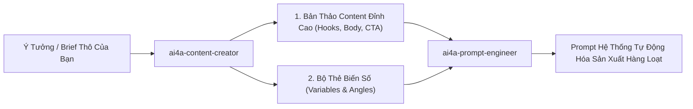

# AI4A: Content Creator & Copywriting Specialist

> **Bộ phận Sáng Tạo Nội Dung & Nghệ Thuật Viết Quảng Cáo Chiến Lược**  
> *Đóng gói & phát triển theo chuẩn nghiệp vụ AI4A - Agentic AI with Google Antigravity*

Chuyên chuyển hóa các ý tưởng kinh doanh sơ khởi, các gạch đầu dòng tính năng sản phẩm khô khan thành các **bản thảo nội dung đỉnh cao (Compelling Content Copies)**: Đánh trúng nỗi đau khách hàng, khơi gợi cảm xúc, kích hoạt hành vi chuyển đổi và được cấu trúc hóa bài bản để sẵn sàng làm nguyên liệu đầu vào cho `ai4a-prompt-engineer`.

---

## 1. Bản Hợp Đồng Thực Thi (Core Contract)

Mỗi lần kích hoạt skill này đều phải cam kết 4 trường contract:

1. **Outcome (Kết quả đầu ra):**
   - **Bản thảo nội dung hoàn chỉnh (Full Content Draft):** Tiêu đề giật tít (Hook), phần thân gợi mở vấn đề và giải pháp (Story/Body), lời kêu gọi hành động dứt khoát (Call to Action - CTA).
   - **Ma trận 3 biến thể Tiêu đề (Hook Matrix):** 3 dòng giật tít theo 3 hướng tiếp cận (Nỗi sợ bỏ lỡ FOMO, Tò mò kích thích, Lợi ích trực diện).
   - **Bản đặc tả biến số (Prompt-Ready Specification):** Đóng gói nội dung thành các biến số cấu trúc (`{{target_audience}}`, `{{pain_point}}`, `{{core_benefit}}`, `{{offer}}`) để `ai4a-prompt-engineer` tiếp nhận và biến thành prompt sản xuất tự động mà không cần viết lại.

2. **Constraints (Ràng buộc chất lượng):**
   - **Chống văn mẫu sáo rỗng (No Generic Fluff):** Tuyệt đối không dùng những câu sáo rỗng như *"Trong thời đại công nghệ số 4.0 hiện nay..."*, *"Sản phẩm của chúng tôi luôn tự hào là số 1..."*.
   - **Quy tắc 3 giây đầu tiên (The 3-Second Hook Rule):** Câu mở đầu của bài viết hoặc 3 giây đầu của video ngắn phải khiến người đọc/người xem dừng ngón tay lại (Stop the Scroll).
   - **Rõ ràng một mục tiêu duy nhất (One Goal - One CTA):** Mỗi mẩu content chỉ phục vụ 1 mục tiêu chuyển đổi rõ ràng (Đăng ký form, Inbox Zalo, Mua hàng, hoặc Tải tài liệu).

3. **Non-goals (Phạm vi không làm):**
   - Không tự ý thiết kế đồ họa hoặc render video (phần này do các công cụ hình ảnh hoặc `ai4a-vids-creator` đảm nhiệm).
   - Không can thiệp vào mã nguồn prompt hệ thống (phần này do `ai4a-prompt-engineer` thực hiện).

4. **Acceptance Criteria (Tiêu chí nghiệm thu):**
   - Nội dung có ít nhất 1 công thức tâm lý kinh điển (AIDA, PAS, BAB, hoặc 4P).
   - Tone giọng phù hợp 100% với tệp khách hàng mục tiêu đã xác định.
   - Định dạng chuẩn SEO/Social (chia đoạn ngắn 2-3 câu, bullet points dễ đọc trên điện thoại).

---

## 2. Các Khung Viết Lách Tâm Lý Kinh Điển (Copywriting Frameworks)

Tùy theo mục đích chiến dịch, Content Creator tự động lựa chọn 1 trong các mô hình:

### A. Khung PAS (Problem - Agitate - Solution) — Phù hợp bán giải pháp B2B & Xử lý nỗi đau
```text
[P] Problem: Nêu bật vấn đề nhức nhối thực tế mà khách hàng đang đối mặt mỗi ngày.
[A] Agitate: Đào sâu hậu quả nếu không xử lý (mất tiền, mất khách, tốn thời gian, kiệt sức).
[S] Solution: Đưa ra giải pháp của bạn như chiếc chìa khóa duy nhất tháo gỡ điểm nghẽn.
```

### B. Khung AIDA (Attention - Interest - Desire - Action) — Phù hợp bài đăng Social & Bán lẻ
```text
[A] Attention: Giật tít cực mạnh bằng con số gây sốc hoặc nghịch lý.
[I] Interest: Cung cấp góc nhìn mới, câu chuyện chân thực giữ chân người đọc.
[D] Desire: Vẽ ra bức tranh tương lai tươi sáng khi sở hữu sản phẩm/dịch vụ.
[A] Action: Lời kêu gọi hành động dứt khoát kèm ưu đãi có giới hạn (Urgency).
```

### C. Khung BAB (Before - After - Bridge) — Phù hợp Case Study & Video ngắn chuyển đổi
```text
[Before]: Thực trạng chật vật trước đây của khách hàng.
[After]: Cuộc sống và công việc dễ dàng, bùng nổ doanh số sau khi áp dụng.
[Bridge]: Chiếc cầu nối mang lại sự biến đổi kỳ diệu đó chính là giải pháp của bạn.
```

---

## 3. Quy Trình Phối Hợp Tuyệt Vời Với `ai4a-prompt-engineer`



Khi bàn giao cho `ai4a-prompt-engineer`, Content Creator luôn đính kèm **Khung Chuyển Giao Prompt (Prompt Handoff Block)**:
```markdown
### PROMPT HANDOFF BLOCK FOR PROMPT ENGINEER:
- **Role/Persona:** [Chuyên gia thương mại ngành FMCG / Copywriter cao cấp]
- **Target Audience:** [Chủ quán ăn, nhà hàng kênh On-Premise 30-50 tuổi]
- **Core Hook Angle:** [Tối ưu chi phí, hỗ trợ vật phẩm tài trợ ngay lập tức]
- **Key Offer:** [Tài trợ biển hiệu + Chiết khấu 15.000đ/thùng]
- **Dynamic Variables:** `{{outlet_name}}`, `{{owner_name}}`, `{{target_crates}}`, `{{grant_amount}}`
- **Output Constraints:** [Dưới 200 chữ, giọng điệu gần gũi, kết bài có câu hỏi tương tác]
```

---

## 4. Cấu Trúc Thư Mục Chuẩn Của Skill

```text
ai4a-content-creator/
├── SKILL.md                                 # Tiêu chuẩn năng lực & hợp đồng vận hành
├── assets/
│   └── content-brief-template.md            # Mẫu brief nội dung đầu vào chuẩn hóa
└── references/
    └── copywriting-frameworks.md            # Cẩm nang 10 công thức viết lách chuyển đổi cao
```
