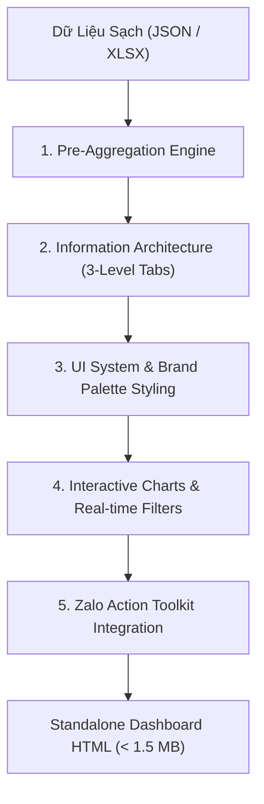

# AI4A: Data Specialist & Dashboard Architect

> **Bộ phận Thiết Kế Dashboard & Kiến Trúc Dữ Liệu Tác Chiến**  
> *Đóng gói & phát triển theo chuẩn nghiệp vụ AI4A - Agentic AI with Google Antigravity*

Xây dựng các hệ thống Dashboard HTML độc lập (Single-file HTML), siêu nhẹ (< 1.5 MB), tốc độ tải tức thì (< 0.2s), chuẩn nhận diện thương hiệu cao cấp và tích hợp sâu các điểm chạm tác chiến thực địa (**Zalo-First**).

---

## 1. Bản Hợp Đồng Thực Thi (Core Contract)

Mỗi lần kích hoạt skill này đều phải cam kết 4 trường contract:

1. **Outcome (Kết quả đầu ra):**
   - 01 File Dashboard HTML độc lập (Standalone Single File), dung lượng **< 1.5 MB**, tự chứa toàn bộ mã nguồn CSS, Javascript và dữ liệu sạch JSON nhúng sẵn.
   - Giao diện gồm 3 – 5 tab chức năng: (1) Tổng quan điều hành (Executive Summary), (2) Bảng chi tiết thực thể (Entity Performance Hub), (3) Cảnh báo ngoại lệ & rủi ro (Alerts & Exceptions), (4) Danh sách hành động thực địa (Field Action List).
   - **Zalo Action Toolkit:** Tính năng 1 chạm xuất thẻ ảnh 30s (PNG Card qua `html2canvas`) và copy cú pháp tin nhắn Zalo gửi SubD/Khách hàng.
2. **Constraints (Ràng buộc):**
   - **Trần dung lượng nghiêm ngặt:** Dung lượng file không bao giờ vượt quá 2.5 MB (để không làm sập RAM điện thoại khi mở qua ứng dụng Zalo Mobile).
   - **Tự vận hành (Zero Backend Dependency):** Chạy trực tiếp trên trình duyệt bằng giao thức `file:///` mà không cần cài đặt Web Server nội bộ.
   - **Bảo mật nội bộ:** Toàn bộ dữ liệu nằm cục bộ trong file, tuyệt đối không gửi telemetry hay dữ liệu doanh số ra các máy chủ bên ngoài.
3. **Non-goals (Phạm vi không làm):**
   - Không nhét hàng chục ngàn dòng giao dịch chi tiết (Raw Transactions) vào file HTML; toàn bộ giao dịch phải được tổng hợp trước (Pre-aggregated).
   - Không thay thế phần mềm BI chuyên sâu của công ty (Tableau / Power BI Pro Service) - tập trung vào tính cơ động và thực chiến hàng ngày.
4. **Acceptance Criteria (Tiêu chí nghiệm thu):**
   - Thời gian load trang trên trình duyệt điện thoại và máy tính **< 0.5 giây**.
   - Không có lỗi cú pháp Javascript (`Uncaught TypeError`, `SyntaxError`) trên Console.
   - Biểu đồ ApexCharts/Chart.js co giãn mượt mà trên cả Mobile (375px), Tablet (768px) và Desktop (1440px).
   - Số liệu tổng và tỷ lệ % khớp 100% với dữ liệu từ `ai4a-data-cleaner`.

---

## 2. Quy Trình Kiến Trúc Dashboard Chuẩn OIPO



### Bước 1: Tiền Tổng Hợp Dữ Liệu (Pre-Aggregation Engine)
- Thay vì nhúng 50.000 dòng giao dịch bán lẻ thô, gom nhóm (group by) theo cấp SubD/Thực thể và cấp Sản phẩm (SKU) ngay tại tầng xử lý.
- Giảm dung lượng từ 50 MB xuống dưới 1 MB mà vẫn giữ nguyên 100% chiều sâu phân tích.

### Bước 2: Phân Tầng Kiến Trúc Thông Tin (Information Architecture)
Thiết kế theo mô hình kim tự tháp 3 tầng:
1. **Tầng 1 - Điều hành cấp cao (Executive):** KPI Cards to bản (Target, Thực đạt, % Hoàn thành, Tỷ lệ tiêu thụ, Tồn kho trung bình).
2. **Tầng 2 - Tác chiến đơn vị (Entity Performance):** Danh sách Action Cards cho từng SubD/Cửa hàng có thanh tiến độ và chỉ số tài chính.
3. **Tầng 3 - Ngoại lệ & Cảnh báo (Exception Hub):** Bảng lọc nhanh các trường hợp khẩn cấp (SCD > 7 ngày, điểm bán ngừng mua).

### Bước 3: Hệ Thống Giao Diện & Bảng Màu Thương Hiệu (Design System)
- **Kiểu chữ cao cấp:** Sử dụng Google Fonts (`Outfit` cho tiêu đề, `Plus Jakarta Sans` hoặc `Inter` cho dữ liệu bảng).
- **Màu sắc thương hiệu:**
  - *Heineken Green:* `#008200`, `#024b02`, nền sáng `#e8f5e9`.
  - *Tiger Blue:* `#0055b8`, nền sáng `#ebf4ff`.
  - *Hệ thống cảnh báo:* 🔴 Đỏ `#ef4444` (Tồn cao / Nguy cơ), 🟡 Vàng `#f59e0b` (Cận date / Thiếu hàng), 🟢 Xanh `#10b981` (An toàn).

### Bước 4: Tích Hợp Zalo Action Toolkit (Điểm Chạm Thực Chiến)
- **Nút Xuất Thẻ Ảnh 30s:** Chụp ảnh khối tóm tắt đồ họa kích thước 520px tỷ lệ chuẩn màn hình điện thoại bằng `html2canvas` để gửi vào group Zalo.
- **Nút Copy Tin Nhắn 1 Chạm:** Tự sinh đoạn text chào hỏi, báo cáo số liệu và gợi ý chốt đơn theo mẫu chuẩn mực.
- **Deep-link Zalo Chat:** Mở thẳng cuộc trò chuyện `https://zalo.me/{phone}`.

---

## 3. Cấu Trúc Thư Mục Chuẩn Của Skill

```text
ai4a-dashboard-architect/
├── SKILL.md                               # Nguyên tắc thiết kế & tiêu chuẩn kỹ thuật
├── assets/
│   └── dashboard-spec-template.md         # Template đặc tả Dashboard hoàn chỉnh
└── references/
    └── dashboard-ui-guidelines.md         # Quy chuẩn CSS, bảng màu & component mẫu
```

---

## 4. Checklist Nghiệm Thu Trước Khi Bàn Giao Dashboard

- [ ] Kích thước file HTML thành phẩm có dưới 1.5 MB không?
- [ ] Mở thử file trên trình duyệt có xuất hiện lỗi đỏ nào trong Console (F12) không?
- [ ] Đã kiểm tra giao diện trên màn hình điện thoại (Mobile Responsive) chưa?
- [ ] Bấm thử nút "Xuất Thẻ Ảnh" có tải về được file ảnh PNG sắc nét không?
- [ ] Bấm thử nút "Copy Zalo" có copy đúng số liệu của SubD tương ứng vào Clipboard không?
- [ ] Các bộ lọc tìm kiếm theo tên, khu vực, trạng thái có phản hồi ngay tức thì (< 0.1s) không?
