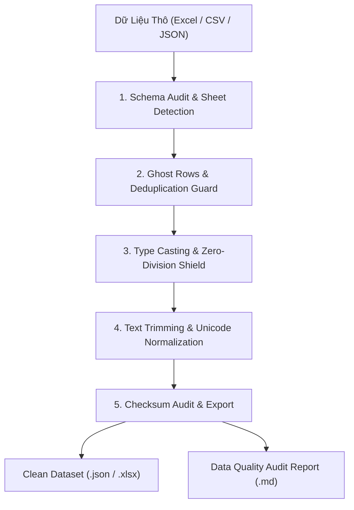

# AI4A: Data Cleaner & Sanitization Specialist

> **Bộ phận Chuẩn Hóa & Làm Sạch Dữ Liệu Tự Động**  
> *Đóng gói & phát triển theo chuẩn nghiệp vụ AI4A - Agentic AI with Google Antigravity*

Chuyển hóa các tệp dữ liệu thô hỗn tạp, phân mảnh từ ERP, DMS, Power BI thành các bộ dữ liệu chuẩn chỉnh, tinh gọn và sẵn sàng 100% cho các mô hình phân tích, báo cáo điều hành và Dashboard.

---

## 1. Bản Hợp Đồng Thực Thi (Core Contract)

Mỗi lần kích hoạt skill này đều phải cam kết 4 trường contract:

1. **Outcome (Kết quả đầu ra):**
   - Bộ dữ liệu đã chuẩn hóa (`.xlsx`, `.csv` hoặc `.json`) lưu tại thư mục đích, tuân thủ đúng Data Dictionary.
   - 01 Biên bản kiểm toán làm sạch (`data_cleaning_audit.md`): Ghi nhận chính xác số dòng nạp vào, số dòng rác bị loại bỏ, số giá trị `Null` đã xử lý, và danh sách các cột đã chuyển đổi kiểu dữ liệu.
2. **Constraints (Ràng buộc):**
   - **Bảo toàn dữ liệu gốc:** Không bao giờ ghi đè trực tiếp lên file nguồn (luôn lưu ra file mới hoặc thư mục riêng).
   - **Bảo toàn số học:** Không làm thay đổi giá trị thực của dữ liệu hợp lệ (tổng số tiền, số lượng sau khi lọc phải khớp với tổng các dòng hợp lệ).
   - **Phòng vệ tràn bộ nhớ:** Nhận diện và loại bỏ ngay các sheet Excel bị tràn 1 triệu dòng do định dạng lỗi (như lỗi `Sheet1` trong các bản export PBI).
3. **Non-goals (Phạm vi không làm):**
   - Không tự ý nội suy (impute) dữ liệu doanh số/tài chính nếu chưa có quy tắc kinh doanh cụ thể từ người dùng.
   - Không can thiệp vào tầng trực quan hóa (Visuals/Charts) - phần này do `ai4a-dashboard-architect` đảm nhiệm.
4. **Acceptance Criteria (Tiêu chí nghiệm thu):**
   - Tỷ lệ dòng rỗng/ghost rows = **0%**.
   - 100% các cột số học được ép kiểu an toàn (`double` / `int`), không còn ký tự khoảng trắng hoặc định dạng chuỗi gây lỗi tính toán.
   - Không xảy ra lỗi chia cho 0 (`NaN%`, `Infinity`) khi tính tỷ lệ.
   - Toàn bộ ký tự tiếng Việt hiển thị chuẩn UTF-8 (không bị lỗi `?` hoặc ``).

---

## 2. Quy Trình Chuẩn Hóa 5 Bước (OIPO Architecture)



### Bước 1: Schema Audit & Sheet Detection (Kiểm Tra Cấu Trúc)
- Đọc danh sách toàn bộ các sheet trong workbook.
- Chỉ đọc sheet chứa dữ liệu thực tế (thường là `'Data'` hoặc `'Export'`), **bỏ qua các sheet rác có > 100.000 dòng trống**.
- Quét dòng tiêu đề (Header Row 1 & 2): Tìm cột theo **Tên tiêu đề chuẩn** thay vì số thứ tự cột (Index) để chống lệch cột (Schema Drift).

### Bước 2: Ghost Rows & Deduplication Guard (Lọc Rác & Trùng Lặp)
- Loại bỏ các dòng mà Mã định danh chính (`ID`, `Code`, `RefCode`) bị trống.
- Áp dụng bộ lọc phạm vi địa bàn/chương trình (ví dụ: `AreaName in ('South 2', 'South 9')`).
- Loại bỏ dòng trùng lặp dựa trên khóa chính (`Primary Key`).

### Bước 3: Type Casting & Zero-Division Shield (Ép Kiểu & Phòng Vệ Số Học)
- Ép kiểu số cho toàn bộ các trường sản lượng, doanh thu, tồn kho:
  ```javascript
  const safeNumber = (val) => {
      if (val === null || val === undefined || val === '') return 0;
      const clean = String(val).replace(/,/g, '').trim();
      const num = Number(clean);
      return isNaN(num) ? 0 : num;
  };
  ```
- Áp dụng công thức bọc an toàn tránh lỗi chia cho 0:
  ```javascript
  const safeDiv = (numerator, denominator) => (denominator > 0 ? (numerator / denominator) * 100 : 0);
  ```

### Bước 4: Text Trimming & Unicode Normalization (Chuẩn Hóa Văn Bản)
- Cắt bỏ khoảng trắng thừa ở đầu/cuối (`Trim()`).
- Chuyển đổi mã hóa tiếng Việt về chuẩn **Unicode UTF-8 with BOM** hoặc chuẩn ASCII Escape để tương thích 100% trên mọi nền tảng di động và Zalo.

### Bước 5: Checksum Audit & Export (Đối Soát & Xuất File)
- Tính tổng kiểm tra (Checksum): Tổng sản lượng nạp vào vs. Tổng sản lượng lưu ra.
- Xuất file dữ liệu sạch và tạo báo cáo đối soát.

---

## 3. Cấu Trúc Thư Mục Chuẩn Của Skill

```text
ai4a-data-cleaner/
├── SKILL.md                                 # Hướng dẫn nghiệp vụ & quy tắc vận hành
├── assets/
│   └── data-cleaning-manifesto-template.md  # Template báo cáo kiểm toán dữ liệu
└── references/
    └── cleaning-rules.md                    # Bộ quy tắc chuẩn hóa kiểu dữ liệu & schema
```

---

## 4. Danh Sách Kiểm Tra Nhanh (Checklist Trước Khi Xuất Dữ Liệu)

- [ ] Đã kiểm tra sheet hợp lệ, không nạp sheet lỗi tràn 1 triệu dòng?
- [ ] Đã lọc hết dòng rác không có Mã định danh (ID/Code)?
- [ ] Đã quét cột bằng Tên thay vì số thứ tự cột (Column Index)?
- [ ] Đã bọc hàm `safeDiv()` cho tất cả các phép tính chia tỷ lệ %?
- [ ] Đã lưu file thành phẩm dưới định dạng UTF-8?
- [ ] Checksum giữa file nguồn và file sạch khớp 100%?
