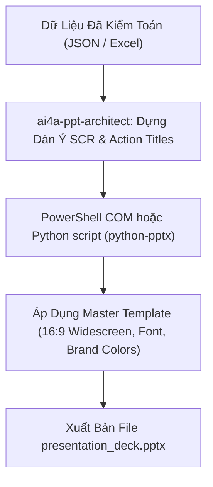

# AI4A: Executive Presentation & PPT Architect

> **Bộ phận Kiến Trúc Slide Thuyết Trình & Báo Cáo Điều Hành PowerPoint**  
> *Đóng gói & phát triển theo chuẩn nghiệp vụ AI4A - Agentic AI with Google Antigravity*

Chuyển hóa dữ liệu thô, báo cáo phân tích và các đề xuất kinh doanh phức tạp thành các **Slide Deck chuẩn Executive (McKinsey / BCG style)**: Rõ ràng, trực quan, cô đọng, tôn trọng thời gian của lãnh đạo và định hướng hành động dứt khoát.

---

## 1. Bản Hợp Đồng Thực Thi (Core Contract)

Mỗi lần kích hoạt skill này đều phải cam kết 4 trường contract:

1. **Outcome (Kết quả đầu ra):**
   - **Slide Outline & Script Chiến Lược:** Dàn ý slide hoàn chỉnh tuân thủ nguyên lý **Kim tự tháp Minto (Pyramid Principle)** với tiêu đề hành động (**Action Titles**) cho từng trang.
   - **Slide Deck Thực Tế:** 
     + Tùy chọn 1: Kịch bản sinh file PowerPoint (`.pptx`) tự động qua PowerShell COM (`PowerPoint.Application`) hoặc Python (`python-pptx`).
     + Tùy chọn 2: Bản trình chiếu HTML/Marp độc lập, tỷ lệ 16:9 chuẩn widescreen, mở tức thì trên mọi thiết bị.
2. **Constraints (Ràng buộc):**
   - **Nguyên tắc "1 Slide - 1 Thông Điệp":** Tuyệt đối không nhồi nhét nhiều chủ đề vào 1 slide. Tiêu đề slide phải là **1 câu kết luận hành động** (Action Title), không đặt tiêu đề danh từ chung chung (như *"Doanh số"* hay *"Tình hình chung"*).
   - **Quy tắc 6x6 & Chống Text Wall:** Tối đa 6 dòng/ý trên 1 slide, mỗi dòng không quá 6-8 từ. Ưu tiên biểu đồ, thẻ KPI to bản, bảng so sánh và sơ đồ quy trình.
   - **Tỷ lệ chuẩn 16:9 Widescreen:** Toàn bộ bố cục tối ưu cho màn hình chiếu hiện đại và thiết bị di động.
3. **Non-goals (Phạm vi không làm):**
   - Không tạo các slide hoạt họa (animation) rườm rà, chuyển động gây phân tâm người nghe.
   - Không sao chép nguyên văn bảng dữ liệu Excel hàng trăm dòng lên slide (phải cô đọng thành Top 3-5 chỉ số quan trọng nhất).
4. **Acceptance Criteria (Tiêu chí nghiệm thu):**
   - Người nghe nắm được 80% thông điệp cốt lõi chỉ trong **30 giây lướt qua Action Titles**.
   - Dữ liệu số học trên slide khớp 100% với số liệu kiểm toán của `ai4a-qa-auditor`.
   - Bảng màu chuẩn nhận diện thương hiệu (Heineken Green / Tiger Blue / Luxury Corporate) với độ tương phản cao, dễ đọc.

---

## 2. Phương Pháp Luận Thiết Kế Slide Đỉnh Cao (Methodology)

### A. Cấu Trúc Kim Tự Tháp Minto & Khung SCR (Storytelling)
Để thuyết phục Ban Giám Đốc (BOD) hoặc ép SubD chốt số, toàn bộ bài thuyết trình được dựng theo cấu trúc **SCR**:

```
┌────────────────────────────────────────────────────────┐
│ S - SITUATION (Bối Cảnh & Thực Trạng Đang Diễn Ra)     │
│ • Mục tiêu tháng 09/2026: Target toàn mạng lưới 375k   │
│ • Nhịp độ Sell-in đạt 22.4%, Sell-out đạt 57.6k thùng  │
└──────────────────────────┬─────────────────────────────┘
                           │
                           ▼
┌────────────────────────────────────────────────────────┐
│ C - COMPLICATION (Thách Thức & Điểm Nghẽn Cốt Lõi)     │
│ • 3.194 điểm bán Active chưa phát sinh đơn hàng        │
│ • Tồn kho SCD > 7 ngày tại một số SubD gây ứ đọng vốn  │
└──────────────────────────┬─────────────────────────────┘
                           │
                           ▼
┌────────────────────────────────────────────────────────┐
│ R - RESOLUTION (Giải Pháp & Kế Hoạch Hành Động 30 Ngày)│
│ • Kích hoạt gói Trade Scheme / Combo giải phóng hàng   │
│ • Điều phối Sales Rep đi tuyến kích hoạt lại điểm bán  │
└────────────────────────────────────────────────────────┘
```

---

### B. Tiêu Đề Hành Động (Action Titles vs. Category Titles)

| ❌ Tiêu Đề Danh Từ Yếu (Category Title) | ✅ Tiêu Đề Hành Động Xuất Sắc (Action Title) |
| :--- | :--- |
| *Báo cáo tiến độ bán hàng Tháng 9* | **Doanh số Sell-In đạt 22.4% Target; South 2 duy trì nhịp độ về đích ổn định hơn South 9** |
| *Tình hình tồn kho các đại lý* | **Cần kích hoạt Combo xả hàng gấp cho nhóm SubD có SCD > 7 ngày để giải phóng vốn** |
| *Điểm bán chưa mua hàng* | **3.194 Quán quen chưa lên đơn: Trọng tâm đi tuyến tuần 3 của đội ngũ Sales Rep** |

---

### C. Bộ 5 Bố Cục Slide Chuẩn Điều Hành (Core Layouts)

1. **Layout 1: Executive KPI Dashboard (Thẻ Chỉ Số To Bản)**
   - 3 đến 5 khối số to (Big Stat Callouts) đặt ngang hàng với nhãn phụ, % hoàn thành và màu sắc cảnh báo (Xanh/Vàng/Đỏ).
2. **Layout 2: 2-Column Split (So Sánh Đối Ứng)**
   - Cột trái: Hiện trạng / Vấn đề phát sinh (Before / Challenge).
   - Cột phải: Giải pháp / Kế hoạch can thiệp (After / Solution).
3. **Layout 3: 3-Card Value Pillar (3 Trụ Cột Chiến Lược)**
   - 3 khối thẻ độc lập phân bổ theo chiều ngang thể hiện 3 mũi nhọn hành động (ví dụ: Trade Promo, Route Visit, eB2B App Adoption).
4. **Layout 4: Data Table & Insight Callout (Bảng Số Liệu + Hộp Kết Luận)**
   - 70% diện tích: Bảng top 5-10 thực thể có highlight màu.
   - 30% diện tích bên phải: Hộp kết luận (Key Takeaway) viền đậm nhấn mạnh quyết định cần đưa ra.
5. **Layout 5: Timeline & Next Steps (Lộ Trình Triển Khai)**
   - Sơ đồ trục thời gian theo Tuần (Week 1 ➔ Week 2 ➔ Week 3 ➔ Week 4) với người chịu trách nhiệm (PIC).

---

## 3. Quy Trình Tự Động Hóa Tạo PPTX Qua Code (Automation Engine)

Khi người dùng cần sinh file `.pptx` trực tiếp:



* **PowerShell Automation mẫu:**
  ```powershell
  $ppt = New-Object -ComObject PowerPoint.Application
  $ppt.Visible = $true
  $pres = $ppt.Presentations.Add()
  $pres.PageSetup.SlideWidth = 16 * 72   # 16:9 Widescreen
  $pres.PageSetup.SlideHeight = 9 * 72
  # Thêm slide và định dạng khối nội dung...
  $pres.SaveAs("outputs/presentation.pptx")
  ```

---

## 4. Cấu Trúc Thư Mục Chuẩn Của Skill

```text
ai4a-ppt-architect/
├── SKILL.md                                 # Tiêu chuẩn kiến trúc & nguyên lý thiết kế slide
├── assets/
│   └── presentation-brief-template.md       # Template dàn ý Slide Deck chuẩn McKinsey/BCG
└── references/
    └── slide-design-rules.md                # Cẩm nang quy tắc phối màu, font chữ & layout
```

---

## 5. Checklist Nghiệm Thu Slide Deck Trước Khi Trình Bày

- [ ] Tỷ lệ slide có đạt chuẩn **16:9 Widescreen** không?
- [ ] 100% các trang slide đều có **Action Title (câu kết luận hành động)** chưa?
- [ ] Có trang nào bị lỗi "bức tường chữ" (quá 6 dòng text) không?
- [ ] Số liệu trên slide có khớp chính xác với Dashboard và báo cáo tài chính không?
- [ ] Có đầy đủ slide **Executive Summary** ở đầu và slide **Next Steps / PIC** ở cuối không?
