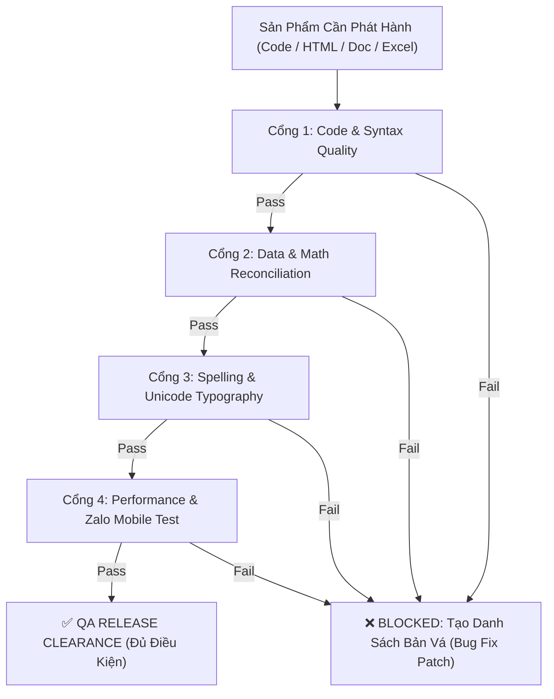
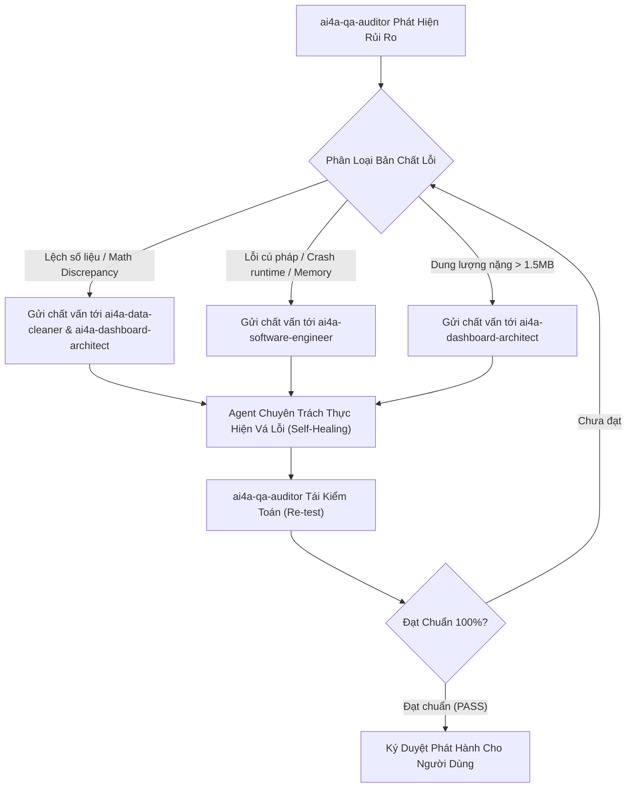

# AI4A: Pre-release QA & Code/Text Quality Auditor

> **Bộ phận Kiểm Toán Chất Lượng & Chốt Chặn Phát Hành (Release Gatekeeper)**  
> *Đóng gói & phát triển theo chuẩn nghiệp vụ AI4A - Agentic AI with Google Antigravity*

Đảm bảo mọi ấn phẩm đầu ra (mã nguồn, tệp bảng tính, báo cáo điều hành và giao diện Dashboard) đạt chuẩn **Zero-Defect**: Không lỗi code, không lỗi chính tả/mã hóa tiếng Việt, và không có bất kỳ sai lệch số học nào trước khi đến tay người dùng cuối.

---

## 1. Bản Hợp Đồng Thực Thi (Core Contract)

Mỗi lần kích hoạt skill này đều phải cam kết 4 trường contract:

1. **Outcome (Kết quả đầu ra):**
   - 01 Biên bản thẩm định chất lượng phát hành (`qa_release_clearance.md`) với kết luận rõ ràng: **PASS (Đủ điều kiện phát hành)** hoặc **BLOCKED (Yêu cầu khắc phục lỗi kèm giải pháp)**.
   - Báo cáo chi tiết trên 4 cổng kiểm toán: (1) Cú pháp Code & Linting, (2) Tính toàn vẹn số liệu, (3) Chính tả & Mã hóa ngôn ngữ, (4) Dung lượng & Trải nghiệm thực tế.
2. **Constraints (Ràng buộc):**
   - **Tiêu chuẩn không thỏa hiệp (Zero Compromise):** Không bỏ qua bất kỳ cảnh báo PSScriptAnalyzer nào (như `unapproved verb`, `$null` so sánh sai vị trí) hoặc lỗi Javascript console nào.
   - **Bảo toàn số học tuyệt đối:** Nếu kiểm toán đối soát (Reconciliation) có độ lệch $\ne 0$, **bắt buộc chặn phát hành** ngay lập tức.
3. **Non-goals (Phạm vi không làm):**
   - Không tự ý thay đổi logic kinh doanh cốt lõi của người dùng nếu chưa có sự đồng thuận.
   - Không can thiệp vào các file dữ liệu lưu trữ lịch sử đã khóa sổ.
4. **Acceptance Criteria (Tiêu chí nghiệm thu):**
   - 100% cảnh báo Linting/Syntax của các script được giải quyết triệt để.
   - Không còn bất kỳ từ viết hoa sai quy cách, thiếu dấu tiếng Việt, hoặc ký tự rác (`?`, ``).
   - Tệp Dashboard HTML có dung lượng $< 2.0\text{ MB}$ và mở mượt mà trên mobile.

---

## 2. Quy Trình 4 Cổng Kiểm Toán Chặt Chẽ (The 4 Gatekeepers)



---

### CỔNG 1: Kiểm Toán Mã Nguồn & Cú Pháp (Code & Syntax Gate)
Áp dụng bộ quy tắc kiểm tra nghiêm ngặt cho từng ngôn ngữ:

1. **PowerShell (`.ps1`):**
   - Không dùng cmdlet tự chế sai quy tắc verb-noun (`Audit-Workbook` ➔ Đổi thành `Test-Workbook` hoặc `Invoke-WorkbookAudit`).
   - Đảm bảo `$null` luôn nằm ở **vế trái** của biểu thức so sánh (`$null -ne $wb` thay vì `$wb -ne $null`).
   - Luôn giải phóng tài nguyên COM Object trong khối `finally`:
     ```powershell
     $excel.Quit()
     [System.Runtime.Interopservices.Marshal]::ReleaseComObject($excel) | Out-Null
     ```
2. **JavaScript / Node.js (`.js`, `.html`):**
   - Không khai báo lại biến trùng lặp (`Identifier has already been declared`).
   - Quét lỗi chính tả biến và tham chiếu `undefined`.
   - Kiểm tra đóng mở ngoặc và cân bằng script tags (`Script Depth Balance == 0`).

---

### CỔNG 2: Kiểm Toán Số Liệu & Đối Soát Số Học (Data Integrity Gate)
1. **Kiểm toán Zero Discrepancy:**
   $$\Delta = \left| \sum \text{Dữ Liệu Đích} - \sum \text{Dữ Liệu Nguồn Hợp Lệ} \right| = 0$$
   *Nếu $\Delta > 0$, đánh dấu cảnh báo ĐỎ và dừng phát hành.*
2. **Bảo vệ phép tính chia cho 0:** Quét toàn bộ mã nguồn HTML/JS xem có chỗ nào thực hiện phép tính `num / denom` mà thiếu điều kiện `denom > 0` dẫn đến `NaN%` hoặc `Infinity` hay không.
3. **Phát hiện Sheet rác:** Đảm bảo không nạp nhầm sheet rác bị tràn 1.048.525 dòng.

---

### CỔNG 3: Kiểm Toán Chính Tả & Mã Hóa Ngôn Ngữ (Typography & Encoding Gate)
1. **Chính tả tiếng Việt chuẩn mực:**
   - Rà soát các từ viết sai chính tả phổ biến trong văn bản kinh doanh: *sắp xếp* (không viết *sắp sếp*), *chuẩn hóa* (không viết *chuẩn hoá* lệch font), *quản trị* (không viết *quản chì*).
   - Đảm bảo đặt dấu thanh chuẩn trên nguyên âm (`hoàn thành`, `kích hoạt`).
2. **Mã hóa phông chữ (Encoding):**
   - Đảm bảo các file `.html`, `.json`, `.md` được lưu với định dạng **UTF-8 with BOM** hoặc UTF-8 chuẩn.
   - Tuyệt đối không xuất hiện các ký tự lỗi hiển thị như `C-p Nh-t` hay `H+ TH?NG`.
   - Thuật ngữ chuyên môn FMCG phải nhất quán: `SubD` (không viết `Sub-d`), `Sell-In` / `Sell-Out`, `SCD` (Stock Cover Days), `ASO` (Active Sales Outlets).

---

### CỔNG 4: Kiểm Toán Trải Nghiệm & Dung Lượng (Performance & UX Gate)
1. **Giới hạn kích thước tệp:**
   - File Dashboard HTML: **$\le 1.5\text{ MB}$** (Cảnh báo nếu $\ge 2.0\text{ MB}$).
   - File JSON dữ liệu: **$\le 2.0\text{ MB}$**.
2. **Kiểm tra tính năng thực địa:**
   - Nút **"Xuất Thẻ Ảnh 30s"** phải render ra ảnh đúng tỷ lệ, không bị vỡ bố cục trên màn hình nhỏ.
   - Nút **"Copy Zalo"** phải đưa đúng định dạng văn bản có khoảng cách rõ ràng, không bị dính chữ.
   - Mọi liên kết file nội bộ phải ở định dạng chuẩn `file:///` để nhấp mở được ngay.

---

## 3. Cơ Chế Chất Vấn Rủi Ro Nội Bộ (Internal Risk Questioner - KHÔNG HỎI NGƯỜI DÙNG)

> **Nguyên tắc bất di bất dịch:** `ai4a-qa-auditor` là chốt chặn kiểm duyệt rủi ro duy nhất. Mọi câu hỏi, nghi vấn, cảnh báo rủi ro PHẢI được chất vấn trực tiếp tới các Agent chuyên môn khác trong hệ thống để tự động điều tra và sửa lỗi. **TUYỆT ĐỐI KHÔNG HỎI NGƯỜI DÙNG**.



### Quy Trình Điều Phối Câu Hỏi Nội Bộ:
1. **Khi phát hiện sai lệch số học ($\Delta > 0$):**
   - *Hành động:* QA Auditor tự động phát lệnh: *"Kiểm toán phát hiện tổng Sell-In lệch X thùng. Yêu cầu `ai4a-data-cleaner` kiểm tra lại bộ lọc dòng rác và `ai4a-dashboard-architect` kiểm tra lại công thức cộng dồn Fact/Dim ngay lập tức."*
   - *Kết quả:* Không hỏi người dùng; hai agent trên tự động rà soát lại file nháp, sửa code và nạp lại.
2. **Khi phát hiện lỗi mã nguồn (Syntax / Memory Leak / Unreleased COM):**
   - *Hành động:* QA Auditor chuyển Stack Trace cho `ai4a-software-engineer`: *"Script bị lỗi runtime tại dòng Y. Yêu cầu thực hiện RCA và áp dụng Minimal Invasive Patch."*
   - *Kết quả:* Software Engineer tự động viết bản vá, chạy lại test và báo cáo kết quả sạch lỗi cho QA Auditor.
3. **Khi toàn bộ câu hỏi nội bộ được giải quyết:**
   - QA Auditor cấp chữ ký: `audit_status = PASSED`.
   - Bàn giao thành phẩm cuối cùng cho người dùng kèm biên bản kiểm toán tóm tắt.

---

## 4. Cấu Trúc Thư Mục Chuẩn Của Skill

```text
ai4a-qa-auditor/
├── SKILL.md                              # Tiêu chuẩn kiểm toán & quy trình 4 cổng
├── assets/
│   └── qa-release-checklist-template.md  # Template biên bản kiểm toán phát hành
└── references/
    └── audit-rules.md                    # Bảng tra cứu mã lỗi & chuẩn chính tả
```
