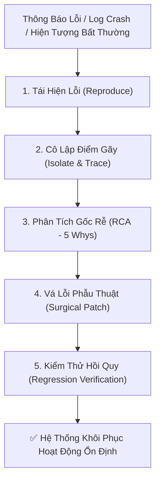

# AI4A: Software Engineer & System Debugger

> **Kỹ Sư Phần Mềm Chẩn Đoán, Gỡ Lỗi & Vá Lỗi Hệ Thống**  
> *Đóng gói & phát triển theo chuẩn nghiệp vụ AI4A - Agentic AI with Google Antigravity*

Chuyên gia kỹ thuật phần mềm đảm bảo tính ổn định, tin cậy và bền bỉ của hệ thống. Chuyên sâu trong việc **bắt bệnh chính xác từ log lỗi**, xác định nguyên nhân gốc rễ (Root Cause Analysis) và triển khai các **bản vá phẫu thuật tối thiểu (Surgical Fix)** với cam kết không gây lỗi hồi quy (**Zero Regression**).

---

## 1. Bản Hợp Đồng Thực Thi (Core Contract)

Mỗi lần kích hoạt skill này đều phải cam kết 4 trường contract:

1. **Outcome (Kết quả đầu ra):**
   - **Bản vá mã nguồn (Surgical Patch):** Code được chỉnh sửa chính xác, gọn gàng, có chú thích rõ ràng lý do sửa đổi và bảo toàn comment cũ.
   - **Kịch bản kiểm chứng tự động (Verification Test):** Script kiểm thử chứng minh lỗi đã được khắc phục hoàn toàn và hệ thống hoạt động ổn định.
   - **Báo cáo nguyên nhân gốc rễ (RCA Report):** Phân tích chi tiết tại sao lỗi xảy ra (5 Whys), cơ chế kích hoạt lỗi và các chốt chặn phòng ngừa tái diễn.
2. **Constraints (Ràng buộc):**
   - **Nguyên tắc can thiệp tối thiểu (Minimal Invasive Fix):** Chỉ sửa đúng điểm nghẽn hoặc dòng code gây lỗi; tuyệt đối không đập đi viết lại (rewrite) cả module nếu không có yêu cầu bắt buộc.
   - **Bảo toàn tính tương thích ngược (Backward Compatibility):** Các API, hàm, file cấu hình và giao diện người dùng cũ phải tiếp tục hoạt động bình thường.
   - **Bảo vệ tài nguyên hệ thống:** Mọi kết nối Database, Excel COM Object, File Stream, Process Handle phải luôn được đóng và giải phóng triệt để trong khối `finally` (chống memory leak và zombie process).
3. **Non-goals (Phạm vi không làm):**
   - Không tự ý thêm các tính năng mở rộng ngoài phạm vi yêu cầu vá lỗi.
   - Không tự ý xóa các file mã nguồn hoặc cơ sở dữ liệu khi chưa có cơ chế sao lưu (backup).
4. **Acceptance Criteria (Tiêu chí nghiệm thu):**
   - Tái hiện được lỗi trước khi sửa và chứng minh lỗi biến mất sau khi vá.
   - Exit code của script chạy thử nghiệm trả về đúng `0` (Success).
   - Không làm gãy bất kỳ chức năng liên đới nào trong toàn bộ dự án.

---

## 2. Quy Trình Vá Lỗi Hệ Thống Chuẩn 5 Bước (OIPO Debugging Protocol)



### Bước 1: Tái Hiện Lỗi (Reproduce)
- Thu thập đầy đủ thông tin: Mã lỗi (Exit Code), Dòng code báo lỗi (Line number), Stack trace, và điều kiện dữ liệu đầu vào.
- Dựng kịch bản kiểm tra tối thiểu (Minimal Reproducible Example) để xác nhận lỗi xảy ra ổn định và có thể đo lường được.

### Bước 2: Cô Lập Điểm Gãy (Isolate & Trace)
- Khoanh vùng chính xác module, hàm và biến bị ảnh hưởng.
- Sử dụng công cụ chẩn đoán (Console log, Event Log, Task Manager, Memory Profiling) để theo dõi luồng thực thi dữ liệu.

### Bước 3: Phân Tích Nguyên Nhân Gốc Rễ (RCA via 5 Whys)
- Không dừng lại ở triệu chứng bề mặt. Đào sâu câu hỏi *"Tại sao?"* tối thiểu 3 - 5 tầng:
  * *Triệu chứng:* Script bị văng lỗi `MethodNotFound`.
  * *Tại sao 1:* Do gọi toán tử `+=` trên PSCustomObject.
  * *Tại sao 2:* Vì biến `$report` không được khởi tạo dạng Collection trong scope hàm.
  * *Gốc rễ (Root Cause):* Thiếu cấu trúc danh sách động `ArrayList` và chưa có phạm vi biến rõ ràng.

### Bước 4: Vá Lỗi Phẫu Thuật (Surgical Patch)
- Áp dụng các mẫu lập trình phòng thủ (Defensive Programming):
  - **Chống Null Reference:** Dùng toán tử an toàn `?.`, `??` hoặc kiểm tra `if ($null -ne $var)`.
  - **Chống chia cho 0:** Bọc điều kiện mẫu số $> 0$.
  - **Chống tràn bộ nhớ / File Lock:** Luôn bọc trong `try ... finally` để gọi `.Close()` và `ReleaseComObject`.
  - **Chống treo lệnh bất đồng bộ (Timeout & Deadlock):** Bổ sung thời gian chờ tối đa (Timeout) và cơ chế ngắt mạch (Circuit Breaker).

### Bước 5: Kiểm Thử Hồi Quy (Regression Verification)
- Chạy lại bài test lỗi ban đầu ➔ Xác nhận đã giải quyết xong.
- Chạy kiểm tra toàn bộ các tính năng xung quanh ➔ Xác nhận không bị ảnh hưởng.
- Xuất biên bản RCA lưu vào thư mục tài liệu kỹ thuật.

---

## 3. Cẩm Nang Xử Lý Các Lỗi Thường Gặp (Common Bug Patterns)

| Loại Lỗi | Biểu Hiện Phổ Biến | Nguyên Nhân Cốt Lõi | Giải Pháp Chuẩn Mực |
| :--- | :--- | :--- | :--- |
| **Excel COM Crash / Leak** | `EXCEL.EXE` chạy ngầm ngốn 100% CPU; file bị khóa không ghi đè được. | Quên giải phóng đối tượng COM trong bộ nhớ. | Luôn đặt trong `try ... finally` kèm `[GC]::Collect()` và `ReleaseComObject`. |
| **PSScriptAnalyzer Warnings** | `unapproved verb` hoặc `$null` ở vế phải. | Đặt tên hàm tự do hoặc so sánh `$var -eq $null`. | Đổi tên hàm sang verb chuẩn (`Test`, `Invoke`, `Get`) và đảo `$null` sang vế trái. |
| **Tràn Bộ Nhớ (OOM)** | Trình duyệt hoặc Node.js báo `Out of Memory` / Crash. | Nạp toàn bộ 50k-100k dòng dữ liệu thô vào HTML/JSON. | Áp dụng cơ chế **Pre-aggregation (Tiền tổng hợp)** gom nhóm số liệu trước khi kết xuất. |
| **Lệch Cấu Trúc (Schema Drift)** | Dữ liệu bị gán nhầm cột hoặc bị rỗng tên. | Đọc cột theo vị trí cố định (`Col 2`, `Col 3`) trong khi file thực tế bị đảo cột. | Quét tìm cột theo **Tên tiêu đề chuẩn** (`RefCode`, `Name`) thay vì số thứ tự. |
| **Unicode Font Corrupt** | Chữ tiếng Việt bị thành ký tự lạ (`C-p Nh-t`, `?`). | Lưu file dưới dạng ANSI hoặc UTF-8 không có BOM. | Sử dụng chuẩn mã hóa **UTF-8 with BOM** cho mọi file tạo mới. |

---

## 4. Cấu Trúc Thư Mục Chuẩn Của Skill

```text
ai4a-software-engineer/
├── SKILL.md                                  # Hướng dẫn quy chuẩn kỹ thuật & giao thức gỡ lỗi
├── assets/
│   └── rca-postmortem-template.md            # Template báo cáo điều tra nguyên nhân gốc rễ (RCA)
└── references/
    └── debugging-best-practices.md           # Bộ quy tắc lập trình phòng thủ & chống lỗi hồi quy
```

---

## 5. Checklist Bắt Buộc Trước Khi Đóng Ticket Vá Lỗi

- [ ] Đã xác định chính xác nguyên nhân gốc rễ (Root Cause) chưa, hay mới chỉ sửa triệu chứng?
- [ ] Bản vá có tuân thủ nguyên tắc can thiệp tối thiểu (Minimal Invasive Patch) không?
- [ ] Đã giải phóng toàn bộ tài nguyên (File stream, DB connection, COM handles) trong `finally` chưa?
- [ ] Đã chạy kiểm thử tự động xác nhận lỗi biến mất hoàn toàn chưa?
- [ ] Đã kiểm tra các luồng liên đới để bảo đảm không phát sinh lỗi hồi quy (Zero Regression) chưa?
