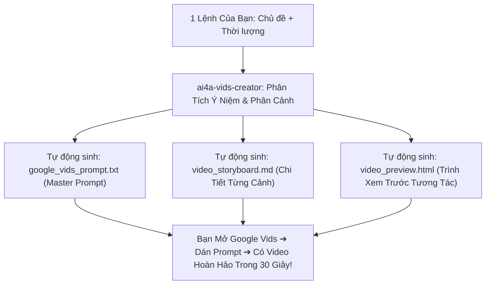

# AI4A: Google Vids AI Creator & Video Producer

> **Bộ phận Sản Xuất Video Tự Động Hóa Google Vids (AI Video Producer)**  
> *Đóng gói & phát triển theo chuẩn nghiệp vụ AI4A - Agentic AI with Google Antigravity*

Chuyên gia chuyển hóa báo cáo, dữ liệu kinh doanh và kịch bản truyền thông thành **Video Doanh Nghiệp Chuẩn Quốc Tế trên nền tảng Google Vids**: Ra 1 câu lệnh duy nhất ➔ Tự động sinh trọn bộ kịch bản phân cảnh (Storyboard), file Master Prompt nạp vào ô *"Help me create a video"* của Google Vids và bản mô phỏng video tương tác (Interactive Preview).

---

## 1. Bản Hợp Đồng Thực Thi (Core Contract)

Mỗi lần kích hoạt skill này đều phải cam kết 4 trường contract:

1. **Outcome (Bộ thành phẩm Video trọn gói):**
   - **File 1 — Master Prompt cho Google Vids AI (`google_vids_prompt.txt`):** Câu lệnh siêu tối ưu được cấu trúc theo đúng thuật toán sinh video của Google Workspace Vids (Role + Goal + Audience + Scene-by-scene script + Voice tone + Music style). Người dùng chỉ cần copy và dán vào ô prompt là Google Vids sinh video ngay lập tức.
   - **File 2 — Bảng phân cảnh chi tiết (`video_storyboard.md`):** Phân rã từng Scene (01 đến N): Thời lượng (giây), Hình ảnh hiển thị (Visual Prompt), Lời đọc thuyết minh (Voiceover Script), Chữ hiển thị trên màn hình (On-screen Text), Nhạc nền (BGM) và Hiệu ứng chuyển cảnh (Transitions).
   - **File 3 — Bản mô phỏng video tương tác (`video_preview.html`):** Ứng dụng web HTML giả lập video player 16:9 hoặc 9:16 có nút Play/Pause/Next Scene, tự động đọc phụ đề và visual cues để xem trước dòng chảy video trước khi render trên Google Vids.
   - **File 4 — Tài liệu nguồn nạp từ Google Drive (`vids_source_doc.md`):** Tối ưu hóa định dạng Markdown để nạp trực tiếp qua tính năng *"Add Google Docs/Slides from Drive"* của Google Vids.

2. **Constraints (Ràng buộc kỹ thuật & thời lượng):**
   - **Nguyên tắc "1 Scene = 1 Ý Niệm Cốt Lõi":** Mỗi phân cảnh dài từ 5 đến 8 giây (tối đa 12 giây cho phân cảnh dữ liệu phức tạp). Không để 1 cảnh kéo dài gây buồn ngủ.
   - **Khớp chuẩn Voiceover & On-screen Text:** Lời thuyết minh (Voiceover) không đọc lại 100% chữ trên màn hình (Chữ trên màn hình chỉ giữ lại từ khóa và con số nổi bật nhất).
   - **Tối ưu tỷ lệ khung hình:** Tự động định dạng 16:9 (màn hình ngang trình chiếu) hoặc 9:16 (video dọc mobile/Zalo).

3. **Non-goals (Phạm vi không làm):**
   - Không xuất file `.mp4` trực tiếp bằng script máy tính cá nhân (việc dựng hình và render video AI do hạ tầng điện toán đám mây Google Vids xử lý trực tiếp).

4. **Acceptance Criteria (Tiêu chí nghiệm thu):**
   - Master Prompt khi dán vào Google Vids hoạt động ngay, không báo lỗi cú pháp.
   - 100% các phân cảnh có đầy đủ chỉ dẫn hình ảnh (Visual cues) và lời thoại Voiceover.
   - Thời lượng tổng thể khớp đúng với yêu cầu của người dùng (30s, 60s, hoặc 90s).

---

## 2. Quy Trình "1 Lệnh Có Video Ngay" (One-Command Pipeline)



---

## 3. Cấu Trúc Phân Cảnh Chuẩn Google Vids (Standard Scene Hierarchy)

Một video 60 giây chuẩn Google Vids được chia thành 6 phân cảnh vàng:

| Scene | Thời Lượng | Vai Trò | Yếu Tố Hình Ảnh (Visual Cue) | Lời Thuyết Minh (Voiceover) |
|:---:|:---:|:---|:---|:---|
| **01** | 0s – 6s | **Hook / Khởi Động** | Tiêu đề to bản, hoạt họa logo công ty | Câu mở đầu giật tít đánh trúng mối quan tâm |
| **02** | 6s – 16s | **Thực Trạng / Nỗi Đau** | Bảng số liệu hoặc hình ảnh đối kháng | Nêu bật điểm nghẽn hoặc kết quả tháng |
| **03** | 16s – 30s | **Trọng Tâm Chiến Dịch** | Video minh họa điểm bán / sản phẩm | Phân tích 3 mũi nhọn hành động cốt lõi |
| **04** | 30s – 44s | **Chỉ Số Đột Phá** | Thẻ Big Stat, biểu đồ tăng trưởng | Làm nổi bật thành tích Sell-In/Sell-Out |
| **05** | 44s – 54s | **Kế Hoạch Tác Chiến** | Lộ trình Timeline theo tuần | Giao chỉ tiêu rõ ràng cho từng đội ngũ |
| **06** | 54s – 60s | **Call To Action (CTA)** | Thông điệp chốt số, hotline, QR Code | Lời kêu gọi hành động quyết liệt về đích |

---

## 4. Công Thức Viết Master Prompt Cho Google Vids AI

Khi nạp vào Google Vids, prompt phải tuân thủ chuẩn cấu trúc 5 tầng của Google AI:

```text
Create a [Duration] [Tone] video in [Aspect Ratio] about [Topic] for [Audience].
Objective: [Clear Business Objective]
Visual Style: Professional corporate style with brand palette [Colors], smooth transitions, clean typography.
Audio: Professional, confident Vietnamese/English AI voiceover with upbeat corporate acoustic background music.

Structure the video into the following scenes:
- Scene 1 (Hook, 0-6s): [Visual description] | On-screen text: [Text] | Voiceover: [Script]
- Scene 2 (Context, 6-16s): [Visual description] | On-screen text: [Text] | Voiceover: [Script]
- Scene 3 (Deep-dive, 16-30s): [Visual description] | On-screen text: [Text] | Voiceover: [Script]
- Scene 4 (Key Metric, 30-44s): [Visual description] | On-screen text: [Text] | Voiceover: [Script]
- Scene 5 (Action Plan, 44-54s): [Visual description] | On-screen text: [Text] | Voiceover: [Script]
- Scene 6 (Outro/CTA, 54-60s): [Visual description] | On-screen text: [Text] | Voiceover: [Script]
```

---

## 5. Cấu Trúc Thư Mục Chuẩn Của Skill

```text
ai4a-vids-creator/
├── SKILL.md                                 # Tiêu chuẩn sản xuất video Google Vids
├── assets/
│   ├── google-vids-prompt-template.md       # Mẫu Master Prompt tối ưu nạp vào ô AI
│   └── storyboard-template.md               # Biểu mẫu phân cảnh storyboard chi tiết
├── references/
    └── google-vids-best-practices.md        # Cẩm nang mẹo chọn giọng đọc, nhạc nền, layout
└── scripts/
    └── generate_vids_kit.js                 # Script tự động hóa sinh trọn bộ video kit
```
