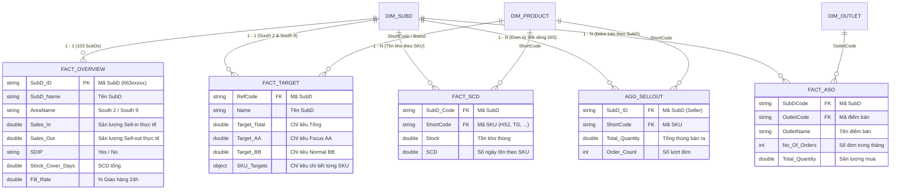

# KIẾN TRÚC & LOGIC KẾT NỐI DỮ LIỆU (DATA CONNECTION & MODEL SPECIFICATION)

## Hệ Thống Heineken SDIP SubD & Sales Performance Tracking Dashboard

> **Tài liệu chuẩn hóa kỹ thuật:** Mô tả chi tiết mô hình dữ liệu (Data Model), các khóa liên kết (Keys), quy tắc lọc (Filter Rules), và luồng tiền tổng hợp (Pre-aggregation Engine) từ 3 – 5 trang báo cáo Power BI xuất ra Dashboard HTML siêu nhẹ (< 1.5 MB) phục vụ tác chiến qua **Zalo**.

---

## 1. Sơ Đồ Thực Thể & Luồng Kết Nối Dữ Liệu (Mermaid ERD & Flow)



---

## 2. Bản Đồ Khóa Liên Kết Dữ Liệu (Relationship Key Matrix)

Để kết nối 5 bảng xuất từ Power BI vào một nguồn sự thật duy nhất (**Single Source of Truth**), các trường khóa được chuẩn hóa như sau:

| Báo Cáo Nguồn (PBI)         | Tên File Excel       | Tên Cột Khóa Trong File        | Chuẩn Hóa Thành Khóa Chung                  | Ghi Chú Kỹ Thuật                                               |
| :----------------------------- | :-------------------- | :-------------------------------- | :---------------------------------------------- | :---------------------------------------------------------------- |
| **1. Overview**          | `Overview.xlsx`     | `SubD_ID`                       | **`SubD_ID`** (String)                  | Mã số 8 chữ số (ví dụ:`66300269`). Khóa chính.          |
| **2. Target**            | `target/*.xlsx`     | `RefCode`                       | **`SubD_ID`** (String)                  | Trùng khớp với`SubD_ID`. Cần đọc đúng sheet `'Data'`. |
| **3. Tồn Kho (SCD)**    | `SCD.xlsx`          | `SubD Code` & `ShortCode`     | **`SubD_ID`** & **`ShortCode`** | Khóa phức hợp`SubD_ID + ShortCode`.                          |
| **4. Bán Ra (DIS)**     | `DIS Volume.xlsx`   | `From_Customer_ID[Customer_ID]` | **`SubD_ID`** (String)                  | Bên bán (Seller ID) chính là Mã SubD.                        |
| **5. Điểm Bán (ASO)** | `ASO detail.xlsx`   | `SubDCode` & `OutletCode`     | **`SubD_ID`** & **`Outlet_ID`** | Nối với Master Outlet`OL YTD.xlsx` qua `OutletCode`.        |
| **6. Danh Mục SKU**     | `Product Name.xlsx` | `Product Name` / `ShortCode`  | **`ShortCode`** (String)                | Mã viết tắt chuẩn (ví dụ:`HS2` - Heineken Silver Can).    |

---

## 3. Quy Tắc Lọc & Làm Sạch Dữ Liệu (Data Sanitization Rules)

### Quy Tắc 1: Lọc Sạch Dòng Rác Trong `Overview.xlsx`

* **Vấn đề:** File `Overview.xlsx` có 3.900 dòng nhưng có tới **3.796 dòng rỗng Area** (Ghost rows).
* **Điều kiện lọc bắt buộc:**
  $$
  \text{Filter: } \text{AreaName} \in \text{['South 2', 'South 9']} \quad \text{AND} \quad \text{SubD\_ID} \ne \text{''}
  $$
* **Kết quả:** Giữ lại chính xác **103 SubD** thực tế (51 SubD thuộc South 2, 52 SubD thuộc South 9).

### Quy Tắc 2: Phòng Vệ Lỗi Tràn Dòng File Target Tháng 9 (South 2)

* **Vấn đề:** File `Sub DistributorTarget-202609-[South 2]_A.xlsx` nặng 11.8 MB do sheet `Sheet1` bị lỗi 1.048.525 dòng.
* **Quy tắc đọc:**
  * **Chỉ đọc duy nhất sheet có tên `'Data'`** (54 dòng).
  * **Tuyệt đối bỏ qua** các sheet `Sheet1`, `Sheet2` để tránh treo bộ nhớ RAM.

### Quy Tắc 3: Xử Lý Lệch Cột (Schema Drift) Trong File Target

* **Vấn đề:** File Target Tháng 9 (South 9) bị hoán đổi cột hoặc gộp dòng khiến cột `RefCode` nằm trước cột `Name`.
* **Quy tắc map:** Quét tìm vị trí cột theo **Tên tiêu đề chuẩn** (`RefCode`, `Name`, `Program`, `Total`) thay vì dùng chỉ mục số cố định (Column Index).

### Quy Tắc 4: Xử Lý An Toàn Phép Tính (Zero-Division Guard)

* Tránh toàn bộ lỗi `NaN%` và `Infinity` trên giao diện bằng hàm bọc an toàn:
  ```javascript
  const safeDiv = (num, denom) => (Number(denom) > 0 ? (Number(num) / Number(denom)) * 100 : 0);
  ```

---

## 4. Cơ Chế Tiền Tổng Hợp (Pre-Aggregation Engine) – Giảm Từ 50 MB ➔ < 1.5 MB

Lý do dashboard cũ bị crash Zalo trên điện thoại là do nhét toàn bộ 44.000 dòng giao dịch bán lẻ thô vào HTML. Logic chuẩn hóa sẽ thực hiện **tiền xử lý ngay tại tầng Engine**:

```
┌────────────────────────────────────────────────────────┐
│ 90.591 dòng DIS Volume (5.5 MB)                       │
│ 6.585 dòng ASO Detail (445 KB)                         │
└──────────────────────────┬─────────────────────────────┘
                           │
                           ▼
┌────────────────────────────────────────────────────────┐
│ TIỀN XỬ LÝ (PRE-AGGREGATION TRONG NODE.JS / PS1)       │
│ • Group by: SubD_ID + ShortCode                        │
│ • Tính sẵn: Tổng thùng bán ra, Số ngày tồn kho SCD     │
│ • Lọc danh sách Outlets: Active nhưng chưa có đơn      │
└──────────────────────────┬─────────────────────────────┘
                           │
                           ▼
┌────────────────────────────────────────────────────────┐
│ DỮ LIỆU ĐẦU RA TINH GỌN (sdip_clean_data.json)         │
│ • Chỉ gồm 103 SubDs x 5-10 chỉ số quản trị cốt lõi     │
│ • Kích thước: ~800 KB (Tải tức thì trong 0.2 giây)     │
└────────────────────────────────────────────────────────┘
```

---

## 5. Bộ Quy Tắc Tính Toán Nghiệp Vụ (Business Logic Formulas)

### 5.1. Nhịp Độ Hoàn Thành Chỉ Tiêu (Target Achievement & Gap Run-rate)

* **% Đạt Target Sell-In (SI):**
  $$
  \% \text{Achieve SI} = \frac{\text{Sales In Volume (Overview)}}{\text{Target Total (Target File)}} \times 100\%
  $$
* **Tỷ lệ Tiêu Thụ Sell-Out / Sell-In:**
  $$
  \text{SO / SI} = \frac{\text{Sales Out Volume (Overview)}}{\text{Sales In Volume (Overview)}} \times 100\%
  $$

### 5.2. Hệ Thống Cảnh Báo Tồn Kho SCD (Stock Cover Days Thresholds)

|  Màu Cảnh Báo  |               Ngưỡng SCD               | Tình Trạng Kho              | Hành Động Điều Hành (Actionable Insight)                                                 |
| :---------------: | :--------------------------------------: | :---------------------------- | :--------------------------------------------------------------------------------------------- |
| 🔴**ĐỎ** |     $\text{SCD} > 7 \text{ ngày}$     | **Tồn kho quá cao**   | Đọng vốn, nguy cơ cận date.**Ưu tiên chạy combo đẩy Sell-out ra điểm bán**. |
| 🟡**VÀNG** |     $\text{SCD} < 3 \text{ ngày}$     | **Tồn kho quá thấp** | Nguy cơ đứt hàng.**Lên đơn Sell-in bổ sung ngay**.                               |
| 🟢**XANH** | $3 \le \text{SCD} \le 7 \text{ ngày}$ | **Tồn kho an toàn**   | Đạt chuẩn vận hành của Heineken.                                                         |

### 5.3. Độ Phủ Đơn Hàng Điểm Bán (% ASO Coverage)

* **Công thức:**
  $$
  \% \text{ASO Coverage} = \frac{\text{Số Outlet Active có đơn trong tháng (Orders > 0)}}{\text{Tổng số Outlet Active do SubD quản lý}} \times 100\%
  $$
* **Cảnh báo Outlets ngừng mua:** Lọc ra chính xác các quán `Active = Yes` nhưng `No Of Orders = 0` để Sales Rep đi tuyến thăm viếng và kích hoạt lại.

---

## 6. Tầng Tác Chiến Zalo (Zalo Action Layer)

Hệ thống kết nối trực tiếp dữ liệu từ bảng tính vào các hành động thực tế qua Zalo:

```
[Dữ liệu 103 SubD đã làm sạch]
               │
               ▼
   ┌───────────────────────┐
   │  ZALO ACTION TOOLKIT  │
   └───────────┬───────────┘
               │
       ┌───────┼────────────────────────┐
       ▼       ▼                        ▼
┌──────────────┐ ┌────────────────────┐ ┌──────────────────────┐
│ XUẤT THẺ ẢNH │ │ COPY TIN NHẮN MẪU  │ │ NÚT CHAT ZALO        │
│    (30 GIÂY) │ │    (1 CHẠM)        │ │    (DEEP-LINK)       │
└──────────────┘ └────────────────────┘ └──────────────────────┘
```

1. **Thẻ Tóm Tắt 30 Giây (Zalo Brief Card):**
   * Đồ họa kích thước chuẩn khung chat điện thoại.
   * Thể hiện trực quan: Tên SubD, % Đạt Target, Cảnh báo SCD (Đỏ/Vàng/Xanh), Top SKU chưa bán, và số lượng quán chưa phát sinh đơn.
2. **Cú Pháp Tin Nhắn Zalo Soạn Sẵn:**
   ```text
   [HEINEKEN SDIP] CẬP NHẬT TIẾN ĐỘ - {SubD_Name}
   - Tiến độ Target: {Actual}/{Target} thùng ({%Achieve}%)
   - Tồn kho SCD: {SCD} ngày ({Status_Warning})
   - Điểm bán chưa lên đơn: {Inactive_Count} quán
   👉 Đề xuất: Lên đơn bổ sung mã {Low_Stock_SKU} và đẩy chương trình {Scheme_Name} cho các quán quen.
   ```
3. **Mở Chat Zalo 1 Chạm:**
   * Tự động điều hướng đến URL `https://zalo.me/{Zalo_Phone}` của chủ đại lý SubD.

---

## 7. Tóm Tắt Luồng Vận Hành 1-Click Update Hàng Tháng

```
Bước 1: Kéo 3 - 5 file report từ Power BI vào thư mục 'thang X'
          │
          ▼
Bước 2: Chạy lệnh 'node build_sdip_engine.js --month X'
          │
          ├─► [1] Lọc 103 SubD South 2 & South 9 từ Overview
          ├─► [2] Đọc sheet 'Data' từ file Target (bỏ sheet lỗi)
          ├─► [3] Map tồn kho & cảnh báo SCD theo SKU
          ├─► [4] Pre-aggregate 90k dòng DIS Volume thành bảng gọn
          └─► [5] Trích xuất danh sách Outlets cần kích hoạt
          │
          ▼
Bước 3: Tự động cập nhật file 'dashboard_v4_lightweight.html' (~1 MB)
          │
          └─► Mở mượt mà trên điện thoại & sẵn sàng tác chiến qua Zalo!
```
