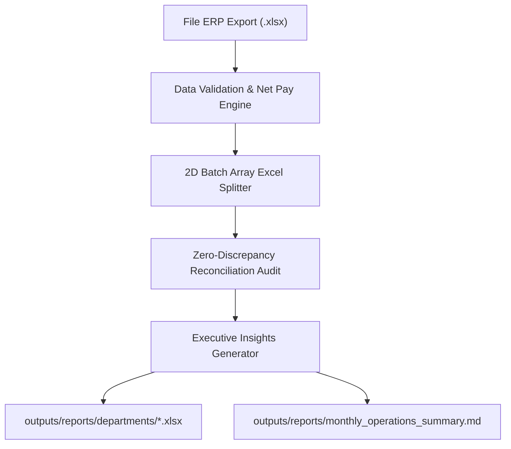

# AI4A: ERP Operations & Payroll Reporter

> **Hệ thống Tự động hóa Phân tách Báo cáo ERP & Kiểm toán Đối soát Số liệu**  
> *Đóng gói chuẩn hóa quy trình nghiệp vụ cho Operations Analyst (AI4A)*

Transform raw monthly ERP exports into professional, department-isolated Excel spreadsheets and executive-grade decision briefs in seconds with zero math discrepancies.

---

## 1. Core Contract (Hợp đồng Thực thi)

Mỗi lần chạy skill này sẽ tự động thiết lập và cam kết 4 trường contract:

1. **Outcome:** 
   - $N$ file Excel con độc lập tại `outputs/reports/departments/` theo từng Bộ phận / Quản lý với header chuẩn, định dạng số tiền tệ và dòng tổng cộng `=SUM()`.
   - 01 File báo cáo tổng hợp điều hành Markdown tại `outputs/reports/monthly_operations_summary.md` (tổng quan KPI, Top Bonus, Cảnh báo Penalty).
2. **Constraints:** 
   - **Bảo mật dữ liệu (Data Isolation):** Mỗi Manager chỉ nhận dữ liệu phòng ban của mình, tuyệt đối không lộ dữ liệu phòng ban khác.
   - **Độ chính xác tuyệt đối:** Kiểm toán đối soát toàn vẹn số liệu (Reconciliation Audit Checksum) phải đạt **Diff = 0**.
3. **Non-goals:** 
   - Không kết nối ghi đè trực tiếp vào cơ sở dữ liệu gốc của hệ thống ERP.
   - Không tự động gửi email ra bên ngoài khi chưa qua bước Human Checkpoint.
4. **Acceptance Criteria:** 
   - Tổng $\text{Net\_Salary} = \sum \text{Base} + \sum \text{Bonus} - \sum \text{Penalty}$ của các file con khớp 100% với file nguồn.
   - Không sót/lặp bất kỳ dòng nhân viên nào.

---

## 2. Quy trình Thực thi Chuẩn OIPO



- **Objective (O):** Tiết kiệm 95% thời gian xử lý thủ công, triệt tiêu rủi ro sai sót công thức Excel.
- **Input (I):** File ERP `.xlsx` trong `sample-data/` chứa 8 cột: `Employee_ID`, `Employee_Name`, `Manager`, `Department`, `Base_Salary`, `Bonus`, `Penalty`, `Month`.
- **Process (P):** 
  1. *Validation:* Nạp dữ liệu, kiểm tra tính hợp lệ và tính `Net_Salary`.
  2. *Batch Split:* Tạo file Excel cho từng phòng ban bằng mảng 2D hiệu năng cao trong Excel COM.
  3. *Audit Check:* Đối soát tổng `Base`, `Bonus`, `Penalty`, `Net` giữa các file con và file gốc.
  4. *Insight Synthesis:* Tổng hợp Top Performance, phòng ban có rủi ro phạt cao và sinh báo cáo.
- **Output (O):** Bộ file Excel chuyên nghiệp + Báo cáo điều hành.

---

## 3. Cấu trúc Thư mục Skill

```text
ai4a-erp-ops-reporter/
├── SKILL.md                               # Định nghĩa & Hướng dẫn sử dụng Skill
├── scripts/
│   └── process_erp.ps1                    # Script tự động hóa xử lý và tách file Excel
├── assets/
│   └── executive-summary-template.md      # Template cấu trúc báo cáo điều hành
└── references/
    └── data-dictionary.md                 # Từ điển dữ liệu & công thức tính toán
```

---

## 4. Hướng dẫn Sử dụng (Usage & Commands)

### Chạy nhanh bằng lệnh mặc định:
```powershell
powershell -ExecutionPolicy Bypass -File ".agents/skills/ai4a-erp-ops-reporter/scripts/process_erp.ps1"
```

### Chạy tùy chỉnh tham số:
| Tham số | Ý nghĩa | Mặc định |
|---|---|---|
| `-InputFile` | Đường dẫn file Excel ERP nguồn | Tự động lấy file đầu tiên trong `sample-data/*.xlsx` |
| `-SplitBy` | Tách theo Bộ phận (`Department`) hoặc Quản lý (`Manager`) | `Department` |
| `-OutputDir` | Thư mục lưu các file con đã phân tách | `outputs/reports/departments` |
| `-SummaryOutput` | Đường dẫn file báo cáo tổng hợp Markdown | `outputs/reports/monthly_operations_summary.md` |

**Ví dụ tách theo Manager:**
```powershell
powershell -ExecutionPolicy Bypass -File ".agents/skills/ai4a-erp-ops-reporter/scripts/process_erp.ps1" -SplitBy "Manager"
```

---

## 5. Tài liệu Tham khảo & Templates

- **Từ điển dữ liệu & Định dạng:** [data-dictionary.md](./references/data-dictionary.md)
- **Mẫu báo cáo điều hành:** [executive-summary-template.md](./assets/executive-summary-template.md)
- **Nhật ký cải tiến quy trình:** `docs/pdca-log.md`
