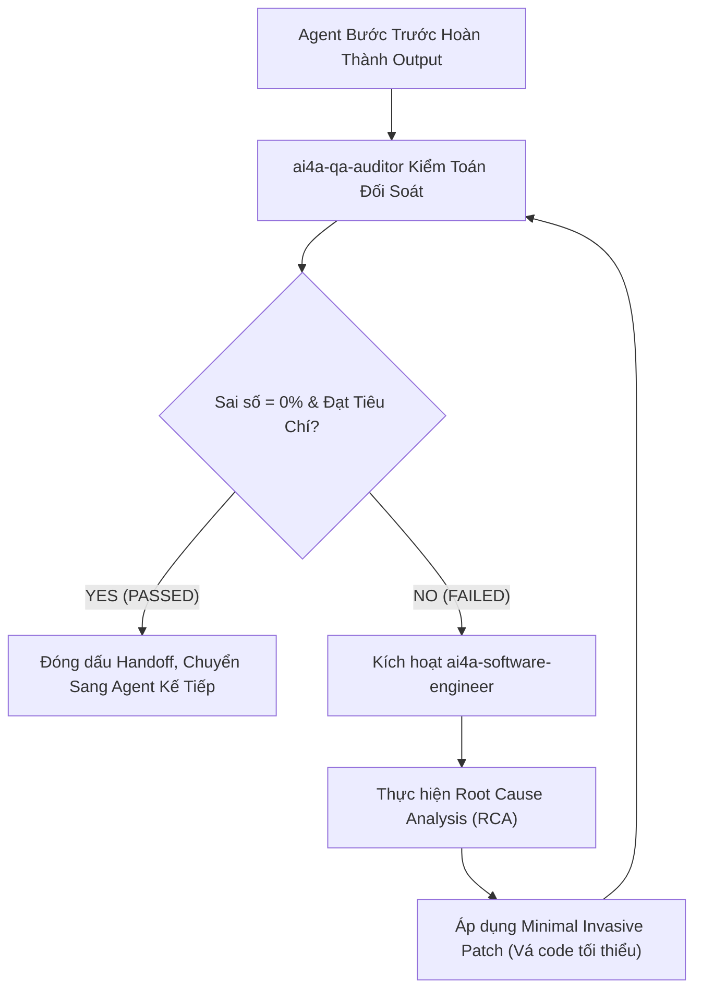

# AI4A: Multi-Agent Master Orchestrator

> **Bộ phận Điều Phối & Tự Động Hóa Đa Tác Tử (Master Multi-Agent Orchestrator)**  
> *Đóng gói & phát triển theo chuẩn nghiệp vụ AI4A - Agentic AI with Google Antigravity*

Chuyển hóa **một câu lệnh duy nhất (Single Prompt / Business Brief)** thành một quy trình thực thi liên hoàn khép kín: Tự động phân rã nhiệm vụ, phân công đúng chuyên viên Agent, kiểm soát việc bàn giao dữ liệu trung gian (Hand-off), chốt chặn chất lượng không sai lệch (Zero Discrepancy) và tự động sửa chữa nếu phát sinh lỗi trước khi bàn giao cho người dùng.

---

## 1. Bản Hợp Đồng Thực Thi (Core Contract)

Mỗi lần kích hoạt skill này đều phải cam kết 4 trường contract cốt lõi:

1. **Outcome (Kết quả đầu ra trọn gói):**
   - Bộ dữ liệu nguồn đã được làm sạch chuẩn UTF-8 tại `outputs/cleansed/`.
   - Thành phẩm phân tích: Executive Dashboard (Single HTML < 1.5MB) hoặc Bảng tính báo cáo phân tách theo Quản lý/Chi nhánh.
   - Báo cáo kiểm toán đối soát số liệu (`reconciliation_audit.md`) đạt **chênh lệch tuyệt đối 0.00%**.
   - Bộ Slide thuyết trình điều hành (16:9 Widescreen `.pptx` hoặc `.html`) tóm tắt kết quả theo nguyên lý Kim tự tháp Minto.
   - Nhật ký điều phối liên agent (`task_manifest.json`) ghi nhận đầy đủ lịch sử chạy của từng khâu.

2. **Constraints (Ràng buộc thực thi):**
   - **Tự trị & Liền mạch (Autonomous Execution):** Không dừng lại giữa chừng để hỏi những câu hỏi kỹ thuật vụn vặt. Agent Trưởng phải tự suy luận các giả định hợp lý dựa trên dữ liệu thực tế và tiếp tục luồng chạy.
   - **Bảo toàn dữ liệu gốc (Immutable Source):** Toàn bộ dữ liệu tại thư mục thô (`sample-data/` hoặc `00_RAW_INGESTION/`) chỉ được đọc (Read-Only), không bao giờ ghi đè.
   - **Nguyên tắc "Không QA Pass, Không Phát Hành" (Strict Quality Gate):** Tuyệt đối không bàn giao kết quả cho người dùng nếu chưa có chữ ký `PASSED` của `ai4a-qa-auditor`.

3. **Non-goals (Phạm vi không làm):**
   - Không can thiệp sửa đổi các cấu hình hệ thống ngoài phạm vi workspace của dự án.
   - Không bỏ qua bước kiểm toán số học để chạy nhanh hơn (tốc độ không được đánh đổi bằng độ chính xác).

4. **Acceptance Criteria (Tiêu chí nghiệm thu):**
   - 100% các Agent thành phần hoàn thành nhiệm vụ theo đúng thứ tự logic.
   - Sai số đối soát tài chính/sản lượng: **Đúng 0.00% (Zero Discrepancy)**.
   - Dung lượng Dashboard HTML: **Dưới 1.5MB** (mở mượt mà < 0.5s trên di động).
   - Có đầy đủ biên bản kiểm toán và tài liệu bàn giao.

---

## 2. Quy Trình Điều Phối 5 Pha (5-Phase Execution Pipeline)

Khi nhận lệnh từ người dùng, Agent Trưởng (Orchestrator) tự động kích hoạt lần lượt 5 pha nghiệp vụ sau:

```
┌─────────────────────────────────────────────────────────────────────────────────────────────┐
│ 1. FRAMING & CONTRACT (ai4a-brainstorm)                                                     │
│ • Chốt mục tiêu OIPO (Objective - Input - Process - Output)                                 │
│ • Khởi tạo bảng kiểm soát trạng thái: task_manifest.json                                    │
└──────────────────────────────────────────────┬──────────────────────────────────────────────┘
                                               │
                                               ▼
┌─────────────────────────────────────────────────────────────────────────────────────────────┐
│ 2. DATA INGESTION & DEEP CLEANSE (ai4a-data-cleaner)                                        │
│ • Đọc dữ liệu thô, loại bỏ dòng rác, xử lý null/NaN, chống chia cho 0                       │
│ • Đồng bộ bảng mã UTF-8 tiếng Việt, xuất file sạch ra outputs/cleansed/                     │
└──────────────────────────────────────────────┬──────────────────────────────────────────────┘
                                               │
                                               ▼
┌─────────────────────────────────────────────────────────────────────────────────────────────┐
│ 3. ANALYTICS MODELING & UI CORE (ai4a-dashboard-architect / ai4a-erp-ops-reporter)          │
│ • Thiết kế mô hình Star Schema (Fact/Dim), gom nhóm Pre-aggregation Engine (< 1.5MB)       │
│ • Dựng giao diện Single-file HTML Dashboard hoặc phân tách Excel theo từng Quản lý         │
└──────────────────────────────────────────────┬──────────────────────────────────────────────┘
                                               │
                                               ▼
┌─────────────────────────────────────────────────────────────────────────────────────────────┐
│ 4. QUALITY GATEKEEPER & AUTO-HEALING (ai4a-qa-auditor & ai4a-software-engineer)             │
│ • Đối soát số học tổng Sell-In/Sell-Out giữa Input vs Output (Zero Discrepancy Reconciliation)│
│ • Quét lỗi bộ nhớ, kiểm tra responsive mobile                                               │
│ • [VÒNG LẶP SỬA LỖI]: Nếu phát hiện lệch số ➔ kích hoạt ai4a-software-engineer vá lỗi ngay!│
│ • Cấp chứng chỉ: audit_status = PASSED                                                      │
└──────────────────────────────────────────────┬──────────────────────────────────────────────┘
                                               │
                                               ▼
┌─────────────────────────────────────────────────────────────────────────────────────────────┐
│ 5. EXECUTIVE DELIVERY (ai4a-ppt-architect)                                                  │
│ • Chuyển hóa insight thành Action Titles chuẩn Pyramid Principle                            │
│ • Xuất bản Slide Deck 16:9 Widescreen & Thẻ Zalo 30s                                         │
│ • Xuất bản Báo cáo nghiệm thu bàn giao cho người dùng                                       │
└─────────────────────────────────────────────────────────────────────────────────────────────┘
```

---

## 3. Cơ Chế Vòng Lặp Tự Động Vá Lỗi (Self-Healing Loop)

Điểm cốt lõi giúp Orchestrator hoạt động **độc lập và không làm phiền người dùng** là khả năng tự phục hồi khi có lỗi:



- **Nguyên tắc vá lỗi:** Can thiệp đúng vị trí phát sinh sai số (như công thức cộng dồn, điều kiện lọc thiếu mã hàng, hoặc lỗi encoding), bảo tồn các logic đang chạy ổn định.
- **Giới hạn an toàn:** Tối đa 3 vòng lặp tự sửa lỗi. Nếu sau 3 lần vẫn chưa đạt chuẩn, Orchestrator sẽ lập báo cáo chi tiết nguyên nhân gốc rễ và đề xuất phương án giải quyết cho người dùng.

---

## 4. Cấu Trúc Thư Mục Chuẩn Của Skill

```text
ai4a-orchestrator/
├── SKILL.md                                 # Tiêu chuẩn điều phối & hợp đồng vận hành
├── assets/
│   ├── orchestrator-manifest-template.json  # Schema quản lý tiến độ hàng đợi task
│   └── orchestration-plan-template.md       # Template kế hoạch điều phối bàn giao
└── references/
    └── multi-agent-pipeline-guide.md        # Cẩm nang thực chiến vận hành đa tác tử
```

---

## 5. Schema Quản Lý Trạng Thái (`task_manifest.json`)

Mọi dự án do Orchestrator dẫn dắt đều duy trì 1 file trạng thái theo chuẩn:

```json
{
  "project_name": "Sales_Dashboard_Automation",
  "orchestrator_version": "1.0.0",
  "current_stage": "STAGE_4_QA_AUDIT",
  "pipeline": [
    { "step": 1, "agent": "ai4a-brainstorm", "task": "OIPO & Target Schema", "status": "COMPLETED" },
    { "step": 2, "agent": "ai4a-data-cleaner", "task": "Sanitize & UTF-8 Encoding", "status": "COMPLETED" },
    { "step": 3, "agent": "ai4a-dashboard-architect", "task": "Pre-aggregation & Single HTML", "status": "COMPLETED" },
    { "step": 4, "agent": "ai4a-qa-auditor", "task": "Zero Discrepancy Reconciliation", "status": "IN_PROGRESS" },
    { "step": 5, "agent": "ai4a-ppt-architect", "task": "Executive Slide Deck 16:9", "status": "PENDING" }
  ],
  "audit_gate": {
    "discrepancy_rate": 0.0,
    "status": "PENDING",
    "signed_by": "ai4a-qa-auditor"
  }
}
```

---

## 6. Mẫu Lệnh Gọi Nhanh Dành Cho Người Dùng

Người dùng chỉ cần đưa ra yêu cầu tự nhiên đi kèm tag skill:

> **Lệnh mẫu 1 (Toàn trình Full Pipeline):**  
> `@[ai4a-orchestrator] Triển khai toàn bộ dữ liệu bán hàng tháng 9 trong sample-data/sales.csv: làm sạch, mô hình hóa dashboard HTML mở tức thì trên mobile, kiểm toán sai số = 0 và xuất bản bộ slide 8 trang cho Ban Giám Đốc.`

> **Lệnh mẫu 2 (Báo cáo Vận hành ERP):**  
> `@[ai4a-orchestrator] Xử lý file ERP chi phí tháng: làm sạch, phân tách Excel theo từng phòng ban, đối soát số liệu và xuất bản slide tổng hợp điều hành.`
