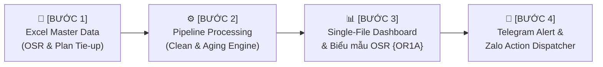
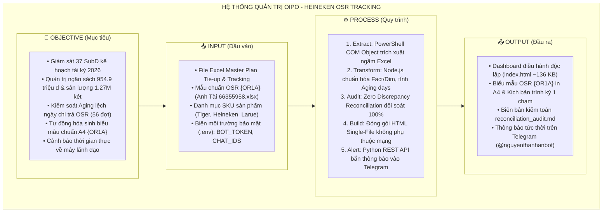

# 🍺 BẢN THIẾT KẾ QUY TRÌNH TỰ ĐỘNG HÓA WORKFLOW THEO MÔ HÌNH OIPO
## DỰ ÁN: HEINEKEN PLAN TIE-UP 2026, OSR PAYMENT TRACKING & OSR FORM {OR1A} COPILOT

> **Đơn vị áp dụng:** Thương Mại & Quản Trị Vận Hành Bán Hàng Heineken (Commercial Intelligence)  
> **Tài liệu tham chiếu:** Khung kiến trúc tự động hóa & Chuẩn hóa luồng công việc AI4A  
> **Tác tử điều phối:** Master Automation Engineer

---

## 🧭 1. ĐỊNH NGHĨA WORKFLOW (Quy Trình Công Việc)

> **Workflow** là một chuỗi các tác vụ được tổ chức có thứ tự logic, rõ ràng và có thể lặp lại; mỗi bước đều có đầu vào, phương pháp xử lý và tiêu chuẩn đầu ra cụ thể nhằm giải quyết trọn vẹn mục tiêu kinh doanh.

Trong dự án **Heineken Plan Tie-up & OSR Payment Tracking**, luồng công việc được chuẩn hóa thành **4 mắt xích liên hoàn**:



1. **Mắt xích 1 - Ingestion:** Tiếp nhận và bóc tách dữ liệu thô từ các bảng tính Excel rời rạc của Sales Supervisor (SS) và Commercial Finance.
2. **Mắt xích 2 - Processing & Audit:** Khử trùng lặp, tính toán độ lệch ngày giải ngân (Aging Delay), phân tầng nhóm TPO/Non-TPO và kiểm toán đối soát sai số tuyệt đối $0.00\%$.
3. **Mắt xích 3 - Visualization & Forms:** Biên dịch thành Dashboard điều hành Single-File HTML siêu nhẹ (< 150 KB) tích hợp biểu mẫu chuẩn in ấn {OR1A}.
4. **Mắt xích 4 - Action Dispatch:** Tự động gửi bản tin điều hành tóm tắt và cảnh báo các đợt chi trễ hạn nghiêm trọng đến điện thoại của cấp quản lý (Anh An & Anh Tuấn).

---

## 🎯 2. MÔ HÌNH OIPO (Objective – Input – Process – Output)

Khung tư duy **OIPO** phân tách toàn diện dự án thành 4 cấu phần độc lập nhưng gắn kết chặt chẽ:



### Bảng Đặc Tả Chi Tiết Các Cấu Phần OIPO:

| Cấu phần | Thành phần cụ thể | Tiêu chuẩn chất lượng (SLA) |
| :--- | :--- | :--- |
| **Objective** *(Mục tiêu)* | - Minh bạch hóa tiến độ giải ngân ngân sách OSR.<br>- Cảnh báo sớm các đợt chi trễ sâu (>15 ngày) tránh khiếu nại từ đại lý.<br>- Rút ngắn thời gian lập hồ sơ OSR {OR1A} từ 30 phút xuống **30 giây**. | - Không sót đợt thanh toán nào.<br>- Mọi cấp duyệt (SR $\rightarrow$ SS $\rightarrow$ ASM) đều nắm cùng 1 sự thật dữ liệu. |
| **Input** *(Đầu vào)* | - `Plan Tie-up - Target tracking.xlsx`<br>- `OSR Anh Tài 66355958.xlsx`<br>- Token Telegram & danh sách Chat ID (`.env`) | - Đường dẫn file được tự động phát hiện.<br>- Thông tin nhạy cảm được bảo mật tuyệt đối qua biến môi trường. |
| **Process** *(Quy trình)* | - `extract_data.ps1` $\rightarrow$ Trích xuất Excel.<br>- `generate_datamart.js` $\rightarrow$ Tính toán KPIs & Aging.<br>- `build_dashboard.js` $\rightarrow$ Biên dịch Dashboard.<br>- `send_osr_telegram_alert.py` $\rightarrow$ Gửi báo cáo Telegram. | - Thời gian chạy toàn trình $< 10$ giây.<br>- Khả năng tự phục hồi nếu file Excel đang mở. |
| **Output** *(Đầu ra)* | - File [index.html](file:///d:/NTAN/AI%20For%20work/Agentic/my-workspace/plan-tieup-payment-tracking/index.html) chạy offline 100%.<br>- Bộ thẻ Zalo chốt số đàm phán 30s.<br>- Bản tin Telegram gửi cho Anh An (`8901458207`) & Anh Tuấn (`393564943`). | - Sai số tài chính: **Tuyệt đối $0.00\%$**.<br>- Định dạng chuẩn A4 khi in ấn. |

---

## ⚡ 3. BA CẤP ĐỘ AUTOMATION (Levels of Automation)

Quy trình quản trị của Heineken được phân tích và tiến hóa qua 3 cấp độ:

```text
[Cấp độ 1: MANUAL] ──▶ [Cấp độ 2: SEMI-AUTO] ──▶ [Cấp độ 3: FULL AUTOMATION]
  (Thao tác thủ công)      (1-Click Pipeline)         (Tự động hóa hoàn toàn)
```

### So Sánh 3 Cấp Độ Trong Nghiệp Vụ OSR:

| Tiêu chí | Cấp độ 1: Manual (Thủ công) | Cấp độ 2: Semi-Auto (Bán tự động - Hiện tại) | Cấp độ 3: Full Automation (Toàn phần) |
| :--- | :--- | :--- | :--- |
| **Trích xuất dữ liệu** | Mở từng file Excel, dùng hàm VLOOKUP, copy/paste thủ công. | Bấm chạy [Run_Tracking_Pipeline.bat](file:///d:/NTAN/AI%20For%20work/Agentic/my-workspace/plan-tieup-payment-tracking/Run_Tracking_Pipeline.bat), script PowerShell tự động bóc tách dữ liệu trong 2 giây. | File watcher tự động phát hiện khi file Excel được lưu trên OneDrive/SharePoint và kích hoạt pipeline ngầm. |
| **Tính Aging & Lệch ngày** | Đếm ngày bằng tay hoặc dùng hàm `=DATEDIF`, dễ lỗi định dạng ngày tháng. | Script Node.js tự động chuẩn hóa ngày, phân loại 4 cấp độ: Đúng hạn, Trễ nhẹ (1-15 ngày), Trễ sâu (>15 ngày). | Tự động phân tích nguyên nhân trễ hạn (do đại lý chưa đạt sản lượng hay do cấp duyệt tắc nghẽn). |
| **Soạn Biểu Mẫu {OR1A}** | Mở file mẫu Excel, gõ lại từng số liệu, căn chỉnh từng ô để in không bị tràn trang. | Dashboard cung cấp dropdown chọn đại lý, tự động điền toàn bộ 6 mục (A $\rightarrow$ F), in chuẩn khổ A4 ngay. | Tự động xuất file PDF có chữ ký số và gửi email cho ASM duyệt khi hợp đồng cũ sắp hết hạn 30 ngày. |
| **Báo cáo điều hành** | Chụp màn hình Excel, gửi tin nhắn dài dòng qua Zalo/Email. | 1 Click xuất thẻ ảnh Zalo 30s + Copy kịch bản trình ký soạn sẵn. | Tự động gửi báo cáo tóm tắt và danh sách Top đợt trễ hạn vào **Telegram của Anh An & Anh Tuấn lúc 8h30 sáng**. |
| **Thời gian tiêu tốn** | **4 – 6 giờ / tuần** | **5 – 10 giây / lần chạy** | **0 giây** (Chạy nền hoàn toàn) |

---

## 🧠 4. TƯ DUY CỐT LÕI (Core Mindset & Principles)

### 📌 Nguyên tắc 1: "Workflow quan trọng hơn Tool" (Workflow > Tool)
* Các công cụ kỹ thuật (PowerShell, Node.js, Python, HTML5, Telegram Bot API) chỉ là **phương tiện thực thi**.
* Điều cốt lõi làm nên giá trị của dự án chính là **Luồng Nghiệp Vụ Thương Mại Của Heineken**:
  * Hiểu rõ ma trận phân loại: **TPO** (27 SubD) vs **Non-TPO** (8 SubD) vs **TPO Abnormal** (2 SubD).
  * Hiểu rõ cấu trúc tài chính: *Cost per Case* $\times$ *Target Volume* = *Ngân sách đầu tư*.
  * Hiểu rõ các nút thắt giải ngân: Điểm nghẽn không nằm ở việc tính toán, mà nằm ở khâu **kiểm soát tiến độ giải ngân từng đợt (Payment Schedule)** để tránh nợ đọng.

### 📌 Nguyên tắc 2: "Bảo mật là điều không thể bỏ qua trong mọi dự án" (Security First)
* Số liệu kinh doanh của Heineken là **thông tin tuyệt mật**:
  * Ngân sách đầu tư tái ký (954.9 triệu đ).
  * Sản lượng cam kết từng tháng của từng nhà phân phối và đại lý (SubD).
  * Mức hỗ trợ cố định (Fixed Cash) và thưởng sản lượng (Target Incentive).
* **Cam kết bảo mật trong kiến trúc hệ thống:**
  1. **Tách biệt thông tin nhạy cảm:** Token Bot và Chat ID cá nhân được cô lập trong file `.env`, được `.gitignore` bảo vệ nghiêm ngặt.
  2. **Bảo toàn dữ liệu nội bộ (Local-First):** Toàn bộ dữ liệu tổng hợp nằm trong file `tracking_data_mart.json` trên máy tính cục bộ, Dashboard chạy dạng file HTML độc lập, **không đẩy bất kỳ bảng tính nội bộ nào lên các dịch vụ đám mây công cộng**.
  3. **Mã hóa truyền tải:** Các bản tin gửi qua Telegram Bot API được truyền qua giao thức HTTPS có mã hóa TLS tiêu chuẩn quốc tế.

---

## 🚀 5. TRIỂN KHAI THỰC TẾ (Live Pipeline Integration Demo)

Áp dụng trọn vẹn mô hình từ bài học vào thực tế dự án:  
**Excel Source $\rightarrow$ Pipeline Scripts $\rightarrow$ Data Mart $\rightarrow$ Executive Dashboard $\rightarrow$ Telegram Dispatcher**

```text
[1. Excel Data] ──▶ [2. PowerShell & Node.js] ──▶ [3. Data Mart & HTML] ──▶ [4. Telegram Bot API]
   (File OSR)           (Làm sạch & Tính Aging)        (Dashboard Single-File)    (Gửi An & Tuấn)
```

### Bản tin tự động được đẩy trực tiếp về Telegram cá nhân của Lãnh đạo:
* **Người nhận 1:** Anh Nguyễn Thành An (Chat ID: `8901458207`)
* **Người nhận 2:** Anh Tuấn - GĐTT Cà Mau (Chat ID: `393564943`)

Khi chạy file [Run_Tracking_Pipeline.bat](file:///d:/NTAN/AI%20For%20work/Agentic/my-workspace/plan-tieup-payment-tracking/Run_Tracking_Pipeline.bat), hệ thống sẽ kích hoạt liên hoàn cả 4 bước và tự động gửi tin nhắn báo cáo kiểm toán ngay lập tức!
